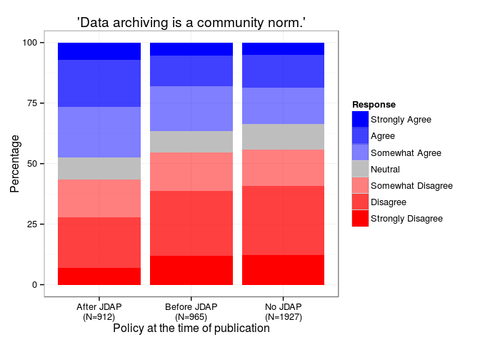
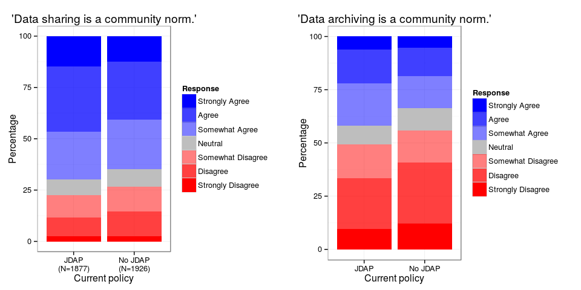
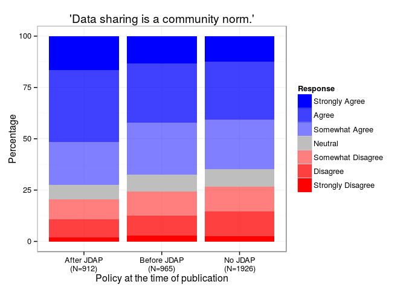
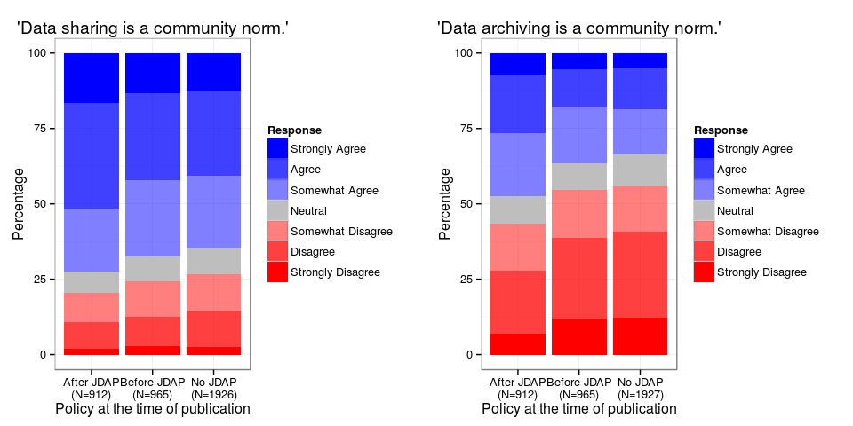

# Data Archiving Attitudes
Heather Piwowar, Pavel Logacev, Todd J. Vision  
May 17, 2015  


This is the abstract for now.

# Introduction
Some researchers are sceptical regarding data archiving. We conducted a survey in order to find out how the adoption of data archiving policies by journals affects researcher's attitudes towards archiving and sharing data.

# The Survey

<!-- load and prepare data -->


The survey was carried out using [Survey Monkey](www.surveymonkey.com). Invitations to participate were sent out to $n$ <!-- TODO: how many? -->
authors by email every month. The average non-response rate was $p$. <!-- TODO: response/non-response rates -->
Figure 1 shows the numbers of invitations and responses by the date of the author's last publication.

Participants filled in a questionnaire consisting of 15 questions, most of which were multiple-choice.

In the following, I will present an overview of the responses to questions 1 and 2. The questions asked about the strength of agreement/disagreement with the following statements:

* _Question 1_ It is the community norm in my field to share, with qualified researchers, datasets that support the results of peer-reviewed research articles. Include data sharing that occurs by any mechanism (e.g. emailing datasets upon request, posting datasets to lab websites, including datasets in journal supplementary information or data repositories).
* _Question 2_ It is the community norm in my field to publicly archive all supporting datasets online, for use by anyone for any purpose, upon publication of a peer-reviewed research article.


 


## Attitudes towards data sharing and archiving by journal type

The following plots show the responses regarding the attitudes towards data sharing and archiving by whether or not the journal has adopted a JDAP-equivalent data archiving policy by now (May 2015).

  

The same plots side by side. Clearly, data sharing is considered more of a community standard than data archiving.
 


## Attitudes towards data sharing and archiving by journal type and journal JDAP adoption date


The following plots show the responses regarding the attitudes towards data sharing and archiving for participants who (i) published in journals which have note adopted the JDAP so far ('No JDAP'), (ii) published in journals which had not _yet_ adopted the JDAP before publication ('Before JDAP'), and (iii) journals which had adopted the JDAP before publication ('After JDAP).

  

The same plots side by side. Clearly, data sharing is considered more of a community standard than data archiving.
 


### Inferential statistics


The potential effect of JDAP adoption on authors' attitudes is might be confounded by two other factors. Firstly, groups of researchers publishing in journals which are not planning to adopt the JDAP (or at least have not done so yet) may inherently differ from groups publishing in journals which were open to adopting the JDAP. Secondly, attitudes regarding data archiving may improve over time. 

In order to test for an effect of policy change on attitudes while controlling for potential confounding effects, we used an ordinal logistic regression model with three predictors: (i) journal type _(cNonJDAPJournal)_, (ii) (centered) publication date in years _(cDate)_, and (iii) a variable indicating whether the article was published after the the journal adopted a data archiving policy _(cAfterPolicyChange)_.

The following table shows the estimated coefficients and 95\%-confidence intervals (transformed to odds ratios) for responses to *question 1*. Effects are statistically significant at the $\alpha=0.05$ level when the transformed confidence intervals do not contain $1$. Confidence intervals were obtained by profile likelihood. According to the model estimates, the introduction of the JDAP data archiving policy significantly increases the odds of a positive response regarding *data sharing* by a factor of $1.36$ (CI=$[1.16; 1.60]$), while the remaining two predictors do not show any statistically significant effects.


We conducted two likelihood-ratio tests to assess the effect of change in policy and the other predictors on reported attitudes. The first likelihood-ratio test, comparing the full three-predictor model with a reduced model _without_ the effect of policy change revealed a significantly better fit for the full model ($\chi^2(1)=13.51$, $p<0.001$). A second likelihood-ratio test comparing the full model with a reduced model using _only_ the policy change predictor (_cAfterPolicyChange_) revealed no statistically significantly difference ($\chi^2(2)=2.77$, $p=0.25$).


```
##                      OR 2.5 % 97.5 %    t
## cAfterPolicyChange 1.36  1.16    1.6  3.7
## cNonJDAPJournal    0.92  0.80    1.1 -1.1
## cDate              0.97  0.91    1.0 -1.0
```

The following table shows the estimated coefficients and 95\%-confidence intervals (transformed to odds ratios) for responses to *question 2*. According to the model estimates, the introduction of the JDAP data archiving policy significantly increases the odds of a positive response regarding *data archiving* by a factor of $1.57$ (CI=$[1.33; 1.90]$), while the remaining two predictors do not show any statistically significant effects.

Here too, we conducted two likelihood-ratio tests to assess the effect of change in policy and the other predictors on reported attitudes. The first likelihood-ratio test, comparing the full three-predictor model with a reduced model _without_ the effect of policy change revealed a significantly better fit for the full model ($\chi^2(1)=29.19$, $p<0.001$). A second likelihood-ratio test comparing the full model with a reduced model using _only_ the policy change predictor (_cAfterPolicyChange_) revealed no statistically significantly difference ($\chi^2(2)=1.42$, $p=0.49$).


```
##                      OR 2.5 % 97.5 %     t
## cAfterPolicyChange 1.57  1.33    1.9  5.40
## cNonJDAPJournal    0.93  0.81    1.1 -1.00
## cDate              1.03  0.97    1.1  0.82
```

