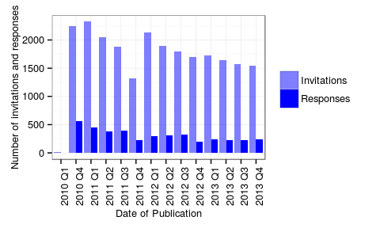
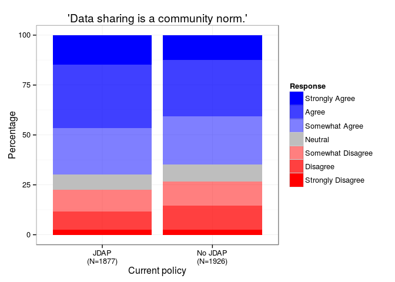
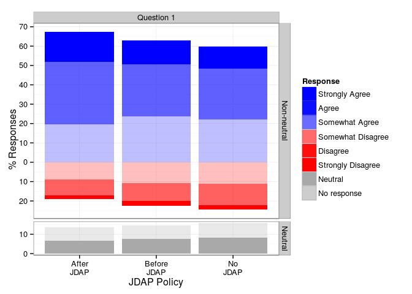
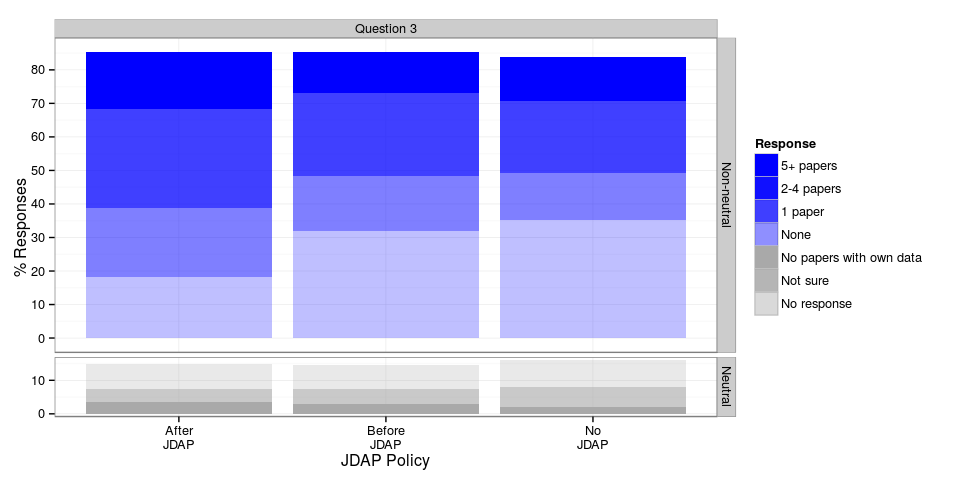
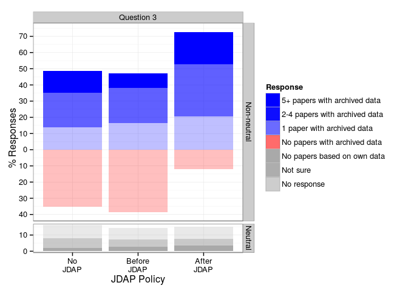
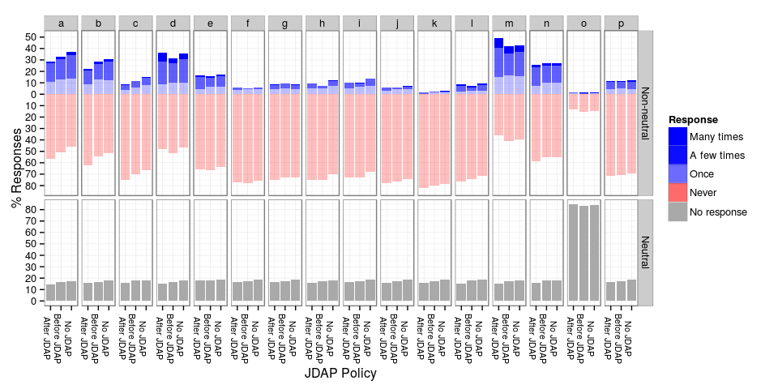
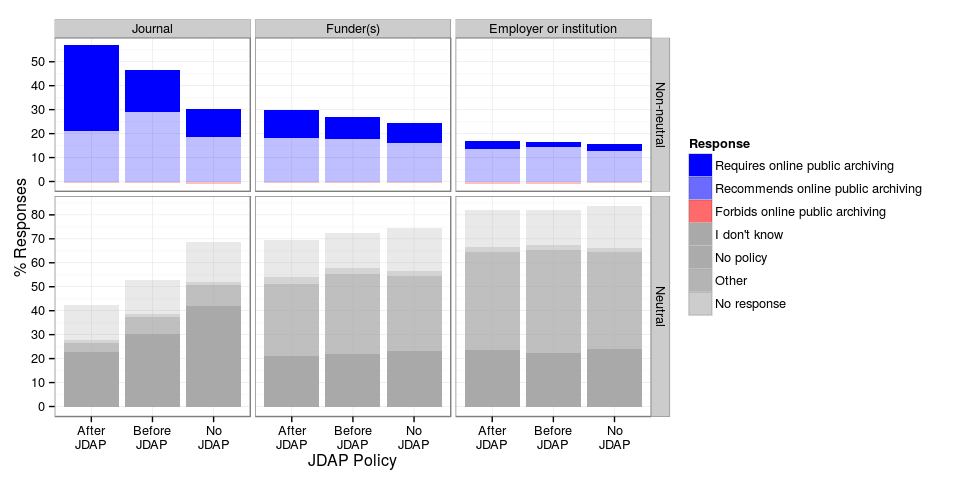

# Data Archiving Attitudes
Heather Piwowar, Pavel Logacev, Todd J. Vision  
May 17, 2015  

This is where the abstract goes.

# Introduction
Some researchers are sceptical regarding data archiving. We conducted a survey in order to find out how the adoption of data archiving policies by journals affects researcher's attitudes towards archiving and sharing data.

# The Survey

## Method

<!-- load and prepare data -->

The survey was carried out using [Survey Monkey](www.surveymonkey.com). Invitations to participate were sent out monthly between February 2011 and March 2014 to a selection of between $605$ and $4763$ (with an average of $2168$) authors of recently published articles in a pre-selected sample of journals. 
<!-- TODO: how were the journals selected -->
The invitations were sent out to a total of $23853$ authors, and $4102$ responded (corresponding to a non-response rate of $17$\%).
Figure 1 shows the numbers of invitations and responses by the date of the author's last publication.
Participants filled in a questionnaire consisting of 15 multiple-choice questions regarding their attitudes, concerns and experiences with data archiving and sharing.

 

<!-- TODO: how were the responses spread out over journal types? when was the JDAP introduced when it was introduced, mean and SD? -->

## Results

In the following, I will present an overview of the responses to questions 1 and 2. The questions asked about the strength of agreement/disagreement with the following statements:

* _Question 1_ It is the community norm in my field to share, with qualified researchers, datasets that support the results of peer-reviewed research articles. Include data sharing that occurs by any mechanism (e.g. emailing datasets upon request, posting datasets to lab websites, including datasets in journal supplementary information or data repositories).
* _Question 2_ It is the community norm in my field to publicly archive all supporting datasets online, for use by anyone for any purpose, upon publication of a peer-reviewed research article.

---

The following plots show the responses regarding the attitudes towards data sharing and archiving for participants who (i) published in journals which have note adopted the JDAP so far ('No JDAP'), (ii) published in journals which had not _yet_ adopted the JDAP before publication ('Before JDAP'), and (iii) journals which had adopted the JDAP before publication ('After JDAP).

 

### Inferential statistics

The potential effect of JDAP adoption on authors' attitudes is might be confounded by two other factors. Firstly, groups of researchers publishing in journals which are not planning to adopt the JDAP (or at least have not done so yet) may inherently differ from groups publishing in journals which were open to adopting the JDAP. Secondly, attitudes regarding data archiving may improve over time. 

In order to test for an effect of policy change on attitudes while controlling for potential confounding effects, we used an ordinal logistic regression model with three predictors: (i) journal type _(cNonJDAPJournal)_, (ii) (centered) publication date in years _(cDate)_, and (iii) a variable indicating whether the article was published after the the journal adopted a data archiving policy _(cAfterPolicyChange)_.

The following table shows the estimated coefficients and 95\%-confidence intervals (transformed to odds ratios) for responses to *question 1*. Effects are statistically significant at the $\alpha=0.05$ level when the transformed confidence intervals do not contain $1$. Confidence intervals were obtained by profile likelihood. According to the model estimates, the introduction of the JDAP data archiving policy significantly increases the odds of a positive response regarding *data sharing* by a factor of $1.36$ (CI=$[1.16; 1.60]$), while the remaining two predictors do not show any statistically significant effects.

We conducted two likelihood-ratio tests to assess the effect of change in policy and the other predictors on reported attitudes. The first likelihood-ratio test, comparing the full three-predictor model with a reduced model _without_ the effect of policy change revealed a significantly better fit for the full model ($\chi^2(1)=13.51$, $p<0.001$). A second likelihood-ratio test comparing the full model with a reduced model using _only_ the policy change predictor (_cAfterPolicyChange_) revealed no statistically significantly difference ($\chi^2(2)=2.77$, $p=0.25$).

<!-- http://kbroman.org/knitr_knutshell/pages/figs_tables.html -->

                        OR   2.5 %   97.5 %      t
-------------------  -----  ------  -------  -----
cAfterPolicyChange    1.36    1.16      1.6    3.7
cNonJDAPJournal       0.92    0.80      1.1   -1.1
cDate                 0.97    0.91      1.0   -1.0

The following table shows the estimated coefficients and 95\%-confidence intervals (transformed to odds ratios) for responses to *question 2*. According to the model estimates, the introduction of the JDAP data archiving policy significantly increases the odds of a positive response regarding *data archiving* by a factor of $1.57$ (CI=$[1.33; 1.90]$), while the remaining two predictors do not show any statistically significant effects.

Here too, we conducted two likelihood-ratio tests to assess the effect of change in policy and the other predictors on reported attitudes. The first likelihood-ratio test, comparing the full three-predictor model with a reduced model _without_ the effect of policy change revealed a significantly better fit for the full model ($\chi^2(1)=29.19$, $p<0.001$). A second likelihood-ratio test comparing the full model with a reduced model using _only_ the policy change predictor (_cAfterPolicyChange_) revealed no statistically significantly difference ($\chi^2(2)=1.42$, $p=0.49$).

                        OR   2.5 %   97.5 %       t
-------------------  -----  ------  -------  ------
cAfterPolicyChange    1.57    1.33      1.9    5.40
cNonJDAPJournal       0.93    0.81      1.1   -1.00
cDate                 1.03    0.97      1.1    0.82

# Appendix

## Appendix A: Questionnaire Structure
<!-- TODO: Add response options below. -->

How strongly do you disagree/agree with the following statements? (Regarding the next two questions.)

<!-- Field: Q4 -->
1. It is the community norm in my field to share, with qualified researchers, datasets that support the results of peer-reviewed research articles. Include data sharing that occurs by any mechanism (e.g. emailing datasets upon request, posting datasets to lab websites, including datasets in journal supplementary information or data repositories).

<!--
_(Strongly Agree - Agree - Somewhat Agree - Neutral - Somewhat Disagree - Disagree - Strongly Disagree)_
-->

 

<!-- Field: Q5 -->
2. It is the community norm in my field to publicly archive all supporting datasets online, for use by anyone for any purpose, upon publication of a peer-reviewed research article.

<!--
_(Strongly Agree - Agree - Somewhat Agree - Neutral - Somewhat Disagree - Disagree - Strongly Disagree)_
-->

 

<!-- Field: Q7 -->
3. Do any of your published research papers have publicly archived datasets?
  a. Yes, datasets from <b>5 or more papers</b> are publicly available on the internet
  b. Yes, datasets from <b>2-4 papers</b> are publicly available on the internet
  c. Yes, a dataset from <b>one paper</b> is publicly available on the internet  
  d. No, none of my paper-related datasets are publicly available on the internet
  e. I've never published a paper based on a dataset collected by me or my co-authors
  f. I'm not sure if any of my papers have publicly available datasets

 

<!-- Field: Q9 -->
4. To your knowledge, how often have you experienced the following situations as a result of sharing the datasets behind your published research with investigators outside your research groups? Include experiences from datasets shared outside your research groups through any mechanism, including public archiving, selected distribution, or shared individually upon request (for example, in response to an email request).
  a.  I formed new collaborations <!-- Field: Q9_1 / Q_4_1 -->
	b.  I formed new collaborations that led/are leading to publications <!-- Field: Q9_2 / Q_4_2 -->
	c.  I formed new collaborations that led/are leading to grants <!-- Field: Q9_3 / Q_4_3 -->
	d.  Others have used my datasets and formally cited me <!-- Field: Q9_4 / Q_4_4 -->
	e.  Others have used my datasets but did not formally cite me <!-- Field: Q9_5 / Q_4_5 -->
	f.  Others have found errors in my research through my datasets <!-- Field: Q9_7 / Q_4_6 -->
	g.  Others misinterpreted my datasets or used them inappropriately <!-- Field: Q9_8 / Q_4_7 -->
	h.  I have had ongoing research projects scooped by another scientist <!-- Field: Q9_9 / Q_4_8 -->
	i.  I have had future research plans scooped by another scientist <!-- Field: Q9_10 / Q_4_9 -->
	j.  The ability of a junior colleague in my group (graduate student, postdoctoral fellow, or junior faculty member) to publish subsequent research has been compromised <!-- Field: Q9_11 / Q_4_10 -->
	k.  My ability to receive commercial benefit from my research has been diminished <!-- Field: Q9_12 / Q_4_11 -->
	l.  I spent a lot of money preparing data for sharing <!-- Field: Q9_13 / Q_4_12 -->
	m.  I spent a lot of time preparing data for sharing <!-- Field: Q9_14 / Q_4_13 -->
	n.  I spent a lot of time answering questions from qualified researchers about my shared data <!-- Field: Q9_15 / Q_4_14 -->
	o.  Other (please specify) <!-- Field: Q9_16 - Q9_16_TEXT / Q_4_15 - Q_4_15_TEXT -->
  p.  I spent a lot of time answering questions from unqualified researchers about my shared data <!-- Field: Q9_17 / Q_4_16 -->

<!--
  Response Options:
  1. Many times
  2. A few times
  3. Once
  4. Never
-->

 

<!-- Field: Q11-->
5. To your knowledge, what are the policies of these stakeholders as they apply to online public archiving of the datasets associated with your (month) (year) publication in (journal)? Choose all that apply
	a.  The journal  <!-- Field: Q11_1 -->
	b.  Your funder(s)  <!-- Field: Q11_2 -->
	c.  Your employer or institution  <!-- Field: Q11_3 -->
  

 

<!-- Field: Q12 -->
6. Are all datasets associated with your (month) (year) publication in (journal) publicly available online?

Response options:
	a.  ALL datasets are publicly available online   <!-- Field: Q12_1 -->
	b.  SOME but not all of the datasets are publicly available online   <!-- Field: Q12_2 -->
	c.  NONE of the datasets are publicly available online   <!-- Field: Q12_3 -->
	d.  I don't know   <!-- Field: Q12_4 -->
	e.  We did not collect any data for that publication   <!-- Field: Q12_5 -->
	f. Other (please specify)   <!-- Field: Q12_6/Q12_6_TEXT -->

  
<!-- Field: Q13 -->
7. IF ALL or SOME datasets associated with this paper are publicly available, where are the datasets hosted?
	a.  Journal supplementary information   <!-- Field: Q13_1 -->
	b.  A repository for data or research output   <!-- Field: Q13_2 -->
	c.  A personal or lab website   <!-- Field: Q13_3 -->
	d.  The entire dataset is in the body of the paper   <!-- Field: Q13_4 -->
	e.  Other (please specify)   <!-- Field: Q13_5/Q13_5_TEXT -->
	f.  Not applicable   <!-- Field: Q13_6 -->
  
  
 

<!-- Field: Q14 -->
8. If NONE or only SOME of the datasets are publicly available, which of the following reflect your experience for the dataset(s) not publicly available, for this paper? Choose all that apply.
	a.  The dataset has been submitted to a repository and is currently under embargo  <!-- Field: Q14_1 -->
	b.  We plan to publicly archive the dataset in the future  <!-- Field: Q14_2 -->
	c.  We plan to share the dataset upon request  <!-- Field: Q14_3 -->
	d.  We hadn't considered publicly archiving the dataset  <!-- Field: Q14_4 -->
	e.  We considered publicly archiving data and decided not to  <!-- Field: Q14_5 -->
	f.  We wanted to publicly archive the data but were not able to, due to resource limitations  <!-- Field: Q14_6 -->
	g.  We wanted to publicly archive the data but were not able to, for other reasons  <!-- Field: Q14_7 -->
	h.  Other (please specify)  <!-- Field: Q14_8/Q14_8_TEXT -->
	i.  Not applicable  <!-- Field: Q14_9 -->
	j.  We wanted to publicly archive the data but were not able to, due to licencing or funder restrictions  <!-- Field: Q14_10 -->
  
  
 
  
The questions below refer to the Joint Data Archiving Policy, an example policy statement adopted by ... <!-- TODO -->

<!-- Field: Q17 -->
9. How strongly do you disagree/agree with this statement? I would seek alternative journals if I learned that my target journal had adopted the Joint Data Archiving Policy (above).

<!--
Response options:
  i. Strongly Agree
  ii. Agree
  iii. Somewhat Agree
  iv. Neutral
  v. Somewhat Disagree
  vi. Disagree
  vii. Strongly Disagree
-->

 

<!-- Field: Q18 -->
10. Imagine you just found a great journal to target when submitting your next manuscript. You read the Instruction to Authors and discover the journal adheres to the Joint Data Archiving Policy (above). How strongly do you disagree/agree with the following statements? I am worried that ...
	a.  others might do research I am currently working on  <!-- Field: Q18_1 -->
	b.  others might do research I am planning to do  <!-- Field: Q18_2 -->
	c.  others might find errors in my research  <!-- Field: Q18_3  -->
	d.  others might misinterpret my dataset or use it inappropriately  <!-- Field: Q18_4 -->
	e.  I/we might be bothered with a lot of questions by qualified people  <!-- Field: Q18_5 -->
	f.  I/we might be bothered with a lot of questions by unqualified people  <!-- Field: Q18_6 -->
	g.  I/we might not be able to find the data  <!-- Field: Q18_7 -->
	h.  it might take me/us a lot of time to find the data  <!-- Field: Q18_8 -->
	i.  it might take me/us a lot of time to format or document the data  <!-- Field: Q18_9 -->
	j.  it might take me/us a lot of time to submit the data  <!-- Field:  Q18_10-->
	k.  I might lose intellectual property or commercial opportunities  <!-- Field: Q18_11 -->
	l.  Other worries (please specify)  <!-- Field: Q18_12/Q18_12_TEXT -->

 

<!-- Field: Q19 -->
11. Same instructions as the previous question: Imagine you just found a great journal to target when submitting your next manuscript. You read the Instruction to Authors and discover the journal adheres to the Joint Data Archiving Policy (above). How strongly do you disagree/agree with the following statements? I am pleased because...
	a.  others will build upon my work more easily  <!-- Field: Q19_1  -->
	b.  I will get more citations  <!-- Field: Q19_2  -->
	c.  I will form more collaborations  <!-- Field: Q19_3  -->
	d.  the contribution will be valued by my promotion or tenure committee  <!-- Field: Q19_4  -->
	c.  the contribution will be valued by my funders  <!-- Field: Q19_5  -->
	d.  I will be able to reuse other work more easily  <!-- Field: Q19_6  -->
	e.  I will be able to reuse other work more often  <!-- Field: Q19_7  -->
	f.  my scientific area will progress more quickly  <!-- Field: Q19_8  -->
	g.  my scientific area will develop better tools and/or training  <!-- Field: Q19_9  -->
	h.  I think it is the right thing to do  <!-- Field: Q19_10  -->
	i.  Other (please specify)  <!-- Field: Q19_11/Q19_11_TEXT  -->

 

How strongly do you disagree/agree with the following statements?

<!-- Field: Q21 -->
12.  Using datasets collected by investigators outside my research group is important in my research.

 

<!-- Field: Q22 -->
13. Using datasets collected by investigators outside my research group is important in my teaching or other non-research projects.

 

<!-- Field: Q23/Q23_TEXT -->
14. Please choose the title that most closely matches yours:
     
<!-- Field: Q25 -->
15. Do you have any comments on the topic, or suggestions for how to improve this questionnaire?

<!-- Field: Q26 -->
16. Thank you for completing this survey! If you would like to enter the drawing for a $20 Amazon gif... <!-- TODO -->

## Appendix B: JDAP Adoption Dates

Journal                                                   Adoption Date of JDAP or Equivalent Policy 
--------------------------------------------------------  -------------------------------------------
American Naturalist                                       01.01.2011                                 
Biological Journal of the Linnean Society                 18.09.2010-03.09.2011                      
Biology Letters                                           01.09.2014-29.10.2014                      
Ecological Applications                                   01.01.2014                                 
Ecological Monographs                                     01.01.2011                                 
Evolution                                                 01.01.2011                                 
Evolutionary Applications                                 01.01.2011                                 
Functional Ecology                                        05.10.2012-5.12.2012                       
GENETICS                                                  01.01.2010                                 
Heredity                                                  01.03.2011                                 
Journal of Animal Ecology                                 01.12.2012                                 
Journal of Ecology                                        5.5.2013 - 3.6.2013                        
Journal of Evolutionary Biology                           24.8.2011 – 24.10.2011                     
Journal of Heredity                                       01.01.2013                                 
Molecular Biology and Evolution                           01.01.2010-31.12.2010                      
Molecular Ecology                                         01.01.2011                                 
Oikos                                                     <06.03.2014                                
PLoS Biology                                              12.10.2014-14.11.2014                      
Systematic Biology                                        01.01.2010-31.12.2010                      
BMC Biology                                               >19.08.2014                                
Genome research                                           <06.07.2008                                
New Phytologist                                           <23.11.2010                                
Proceedings of the Royal Society B: Biological Sciences   <20.03.2013                                
The Plant Journal                                         < 18.08.2010                               

