There have been previous studies of data sharing patterns, but we are not aware of any prior research that examined attitudes and experiences of authors before and after policy implementation.  

The promise of data sharing and the role of data sharing policies

Sharing data is a tenet of science, yet commonplace in only a few subdisciplines.  Publicly available datasets have many potential reuses.  Unfortunately, these advantages only indirectly benefit the stakeholders who bear most of the costs for sharing their datasets: the primary data-producing investigators. As a result, authors often actively or passively withhold their research datasets from other investigators  
[@blumenthal1997withhol; @ochsner2008much-ro; @savage2009empiric].

Recognizing that a data sharing culture is unlikely to be achieved without policy guidance, funders and journals have begun to request and require that investigators share their research datasets with other researchers [@brown2003the-cha; @enriquez2010data-ci]. Funders are motivated by the promise of resource efficiency and rapid progress. The motivation for journals to act as an advocate and gatekeeper for data sharing is less straightforward. Journals seek to publish “well-written, properly formatted research that meets community standards” and in so doing have assumed monitoring tasks to “remind researchers of community expectations and enforce some behaviors seen as advantageous to the progress of science” [@mccain1995mandati]. This role has been encouraged by many letters, white-papers, and editorials in high-profile journals.

Policies should only be adopted if their benefits outweigh their costs, across the wide array of stakeholders [@foster2007share-a]. Requiring data sharing can raise controversy [@campbell2002data-wi; @king1995a-revis], increase short-term system costs [@beagrie2009busines], and possibly motivate authors to seek alternative locations for publishing.  The goal of this study is quantify the some of the short-term benefits and costs of policy adoption in the practices, attitudes, and opinions of data producing authors.

#### Dimensions of impact

A journal policy that requires authors to share the datasets that support their results as a condition of publication may impact the practices, attitudes, and opinions of data producing authors in many ways.  Here, we emphasize the short-term impacts on authors who publish in the policy-adopting journals.

The most direct impact is likely a change in frequency of data sharing, and a shift to data archiving locations specified in the policy.  Early studies suggest that authors who publish in journals with data sharing policies are more likely to share their data than authors who publish similar studies in similar journals [@piwowar2008a-revie; @Piwowar_2011], but these investigations were correlative and did not attempt to directly measure the impact of journal policies over time.  Previous work emphasizes the importance of sharing data through best-practice archiving methods and locations.  Authors who share data upon request often discriminate against use and users [@campbell2008what-ar; @reidpath2001data-sh].  The permanence of data sharing mechanisms is also a concern; email and lab-website based sharing choices have been shown to be impermanent solutions at best [@wren2008url-dec; @wren2006e-mail]. 

An question of particular interest is whether the adoption of data sharing mandates leads authors to perceive that it has become a community norm to share data in their field.  If so, this shift in attitude may in and of itself it may lead to more data sharing: previous research has found that scientists “look beyond their individual interests to social cues from reference groups when deciding whether to withhold or share information requested by others” [@haas2009to-shar].  This is consistent with findings that have found a correlation between information sharing and perceived community norm of openness and sharing [@haeusslerinforma; @kuo2008a-study], as well as evidence that a scientist’s sharing decisions are influenced by expectation of reciprocity [@gouldnertheoret] and that their prior experiences with sharing predicts future sharing decisions [@campbell2002data-sh].

A few previous studies have estimated the impact of sharing data on the experiences of authors [@blumenthal2006data-wi; @gleditsch2003posting; @piwowar2007sharing; @ventura2005mandato], but there is much to be learned in this area to ground expectations, accurately estimate costs and benefits, and learn about ways policies could be improved to enhance positive experiences and avoid negative ones.

Journal publishers and editors may be particularly interested in whether authors start to view data sharing mandates more positively after they have experience with them.  In particular, knowing whether experience with a data sharing policy makes authors more or less likely include the existence of data sharing policies in their decisions about future publishing venues [@bjork2009a-metho] would be of great interest to journals considering the adoption of such policies.

Evaluating the impact of a journal data sharing policy on dataset reuse is also critical.  Such an evaluation would require a longer timeframe than that of the current proposal and may be felt most strongly in a different author population; we hope to pursue this area in future work.

Upcoming policy change is a useful opportunity for policy evaluation

Several journals plan to adopt the Joint Data Archiving Policy in early 2011, as described at http://datadryad.org/jdap.  Participating journals include:

- American Naturalist
- Evolution
- Evolutionary Applications
- Heredity
- Journal of Evolutionary Biology
- Molecular Biology and Evolution.
- Molecular Ecology

This is a great opportunity to study the effect of journal data sharing mandates on the attitudes, behaviour, experiences of authors to help inform future policy decisions.

The JDAP policy requires data sharing in a public archive. Early evidence suggests stronger policies are associated with a higher frequency of data sharing [@piwowar2008a-revie; @Piwowar_2011].  Since JDAP requires data sharing as a condition of publication, studying this policy adoption is an opportunity to possibly measure the maximum likely effect.  Also, since the adopting journals include almost all of the high-impact journals in the field of Evolutionary Science (as per the 2009 ISI JCR), it is likely that even authors who dislike the policies will continue publishing in these journals and possibly participate in our measurement of opinions.

We note that authors in evolution and ecology have been surveyed several other times to assess data sharing attitudes and experiences, but these questionnaires have not been correlated to journal policy adoption [@scherle2008buildin].

Because measurements of actual dataset archiving behavior can be accurately measured with a retrospective analysis of research artifacts, our proposed survey does not emphasize data archiving behaviour.  Instead, the questionnaire will focus on information that is difficult or impossible to collect without a timely survey of data-producing investigators.

Rigorous research is needed into the impact of journal policies

Although some data sharing mandates appear to have achieved almost universal sharing [@noor2006data-sh], this is not always the case [@ochsner2008much-roa].  Several surveys have asked about author’s perceived obstacle to sharing data [@hedstrom2008researc; @scherle2008buildina], but changes in these attitudes have not been monitored across a policy change.  To our knowledge, the impact of data sharing mandates have only been subject to one evaluation:  the editors of Physiological Genomics briefly surveyed their authors and reviewers two years after instituting a policy that required public archiving of gene expression microarray data [@ventura2005mandatoa], though unfortunately no baseline measurements are available about attitudes before the policy.  Interestingly, a recent large-scale evaluation [@Piwowar_2011a] into the prevalence of microarray data sharing found this same journal to have the highest rate of public archiving. 

Robust studies of journal policies are infrequent, even in areas beyond data sharing.  A systematic review in 2006 examined the effect of journal adoption of CONSORT requirements for standard reporting of clinical trials [@plint2006does-th].  It found that most publications about the journal policies were editorials or letters (699 of 1129 articles about the CONSORT policy).  Of the studies, many were non-comparative (231 of 248), only a very few (12) were considered to be comparative studies with appropriate outcomes and sufficient detail, and only one study had predefined control group. The authors conclude that, “Studies evaluating the effectiveness of the CONSORT checklist are methodologically weak” [@plint2006does-th].  This suggests that high quality evaluations are indeed rare and thus potentially valuable contributions.  

Research questions

The specific research questions for this study include:
 
- How do authors’ attitudes, experiences, and practices around public data archiving change when the journals they publish in adopt mandatory data archiving policies?
- Are changes specific to the journals that implement the policies, or do they extend to other journals in the same subfield?

## Primary analysis
The primary analysis will be a seven-point Likert scale asking how strongly authors believe:  “It is the community norm in my field to publicly share datasets upon study publication by archiving all datasets online, for use by anyone for any purpose.”

About twelve other survey questions will allow secondary and exploratory analyses. 


## Methods
Participants will be recruited from corresponding authors who publish in specific journals between November 2010 and November 2013.  Specifically, email addresses will be collected for papers published the previous month (or 3 previous months, for the initial month of recruitment) in each of the target journals through the ISI Web of Science.  No other identifying information (author names, article title, etc) will be retained.

Recruitment email lists will be compared across months, and emails only sent to those who have not previously received a recruitment email to reduce survey fatigue and ill-will.

The email invitation will include a URL where subjects can learn more about the study and then read a fact sheet, consent, and participate if they choose.  This email will also contain an “opt out” option, which will remove their address from the reminder list.  Those who have not “opted out” will be contacted by email again, a week later, politely asking them to take the survey if they haven’t already.

Individual participants can expect to spend 7-10 minutes maximum answering the online questionnaire.

Before the initial round of invitations is sent, I will inform journal editors of this ongoing survey and provide contact information in case they have questions, suggestions, or concerns.

Previous studies suggest 10%-30% of authors will complete the survey [@haeusslerinforma; @wren2007the-wri].

Gender, ethnicity, and race are irrelevant to the study. Other than the requirement that participants be 18 years of age or older, age is irrelevant to the study. Medical history and/or conditions are irrelevant to the study.  

To facilitate legal consent, this study is restricted to participants who are 18 years of age or older. The study is intended to establish knowledge about the implications of policies on active researchers.  No other criteria are necessary for inclusion; no criteria are grounds for exclusion.  


## Methods 2 

We expect the JDAP policies to be implemented in or about January 2011, though it will take several months to see any effect because the policies will likely be applied to newly submitted papers it will take multiple months for these papers to be published.  This timeline is likely to vary across JDAP-adopting journals depending on the length of their publication cycle.

Participants will be recruited from corresponding authors who publish in specific journals between November 2010 and November 2013.  An invitation to the survey will be issued once a month to all corresponding authors who published in specific journals the prior month. The responses of authors who published in JDAP-adopting journals will be compared, over time, to a) the responses of authors who publish in in-community journals that do not adopt JDAP, and b) the responses of authors who publish in outside-community journals that do not adopt JDAP.  

### Data collection

The instrument used to collect data is be an online questionnaire. The questionnaire is designed to elicit the respondent’s practices, experiences, and opinions around public archiving of research datasets by asking about their opinion of community norms, recent behaviour with respect to a recently published paper, previous experiences with data sharing, and attitudes toward hypothetical situations.  

The primary analysis will be a seven-point Likert scale asking how strongly authors believe:  “It is the community norm in my field to publicly share datasets upon study publication by archiving all datasets online, for use by anyone for any purpose.”  About twelve other survey questions will allow secondary and exploratory analyses.  

Aggregate answers will be compared over time, to understand if answers of authors in journals that adopt JDAP begin to differ from those of authors in comparable within-community and outside-community control journals.

The online survey will be administered through ViewsFlash® 6 by Cogix, hosted by Duke University.  There will be no way link the responses with the identities of participants.

### Limitations

The limitations of this study design include:

- There is limited time before JDAP is implemented (~January 2011), so I will only have two pre-JDAP-implementation control time points.  This limitation will be mitigated by the fact that there will be a lag between policy adoption is applicable to submitting authors and when their papers published.
- There are many variables that are also important to views of community norms and decisions about sharing that I am not collecting to keep the survey short and maintain anonymity. These include university characteristics, industry affiliations, subfield, publication rate, and age.
- This study makes no attempt to understand the rigor with which data sharing is encouraged in journals beyond their written policies:  many journals without policies nonetheless expect data sharing and many with written policies fail to enforce them.
- The opinions of corresponding authors with respect to data sharing may not be typical of all authors:  a future study could be done to quantify this.
- By only inviting authors to participate the first time they are listed as corresponding authors within our study scope, the population we are polling will shift gradually over time away from highly-prolific authors.
- Respondents may be reluctant to self-report when they do not share their datasets, particularly as their sense of sharing as a community norm increases, since survey respondents are often reluctant to report engaging in socially undesirable behavior.
- It will be difficult or impossible to derive causality direction for an association between reported data sharing behaviour and reported perception of data sharing as a community norm.
- Finally, this study only facilitates a relatively short-term look at policy effect:  it will likely take many more years for the effect of these policies to be fully felt.


Analysis of policy impact will be done using a modification of the commonly accepted difference-in-difference approach, as described by [@abadie2010synthet].  The responses of authors who published in JDAP-adopting journals will be compared, over time, to a) the responses of authors who publish in in-community journals that do not adopt JDAP, and b) the responses of authors who publish in outside-community journals that do not adopt JDAP.  Because it is not clear which in-community and outside-community journals would provide the best counterfactual control of the JDAP-adopting journals, we will construct a “synthetic control” from a combination of responses across a subset of the control journals, as described in [@abadie2010synthet].

### Sample size

The proposed study is subject to two different types of uncertainty:  uncertainty about the estimation of aggregate parameters, and also “uncertainty about the ability of the control group to reproduce the counterfactual of how the treated unit would have evolved in the absence of the treatment” ([@abadie2010synthet]. It is difficult to know how to conduct a formal power analysis in these conditions.  We have based our sample size decisions on the following information.

For populating the “treatment arm,” we plan to ask all corresponding authors of all JDAP-adopting journals.  The average number of papers published per month in the JDAP journals is 168.  Previous studies suggest 10%-30% of authors will complete the survey [@haeusslerinforma; @wren2007the-wri].  If we assume a response rate of 20%, we will receive about 33 responses from the intervention group every month.  This would result in 95% confidence intervals around a Likert mean of 3.5 out of 7 ranges from 2.4 to 4.6.  If these confidence intervals prove too wide to enable effective comparisons, we could aggregate the monthly data into less frequent samples across time.

For populating the “control arms,” we recognize that the uncertainty is predominantly determined by the applicability of the controls.  Little information is currently available to determine, a priori, which journals will serve as appropriate controls.  As such, we suggest that surveying twice as many control journals as treatment journals may be an appropriate rule of thumb.  This balances the need to avoid overpowering the study (and thereby increasing survey-fatigue and effort) with a desire to ensure the most useful results (anticipating that unexpected future events may render some controls inappropriate during the three years of this study, as well as recognizing that the quality of inference improves as the number of available comparison units increases [@abadie2010synthet].  

Control journals will be selected by manual selection from a set of journals identified through ISI Journal Citation report categories as well as co-citation lists.  Attempts will be made to choose journals with comparable impact factors and inclination to produce quantitative datasets.

A 20% response rate and two control groups that are each twice as large as our treatment arm means we would receive about 33 treatment responses, 66 in-community control responses, and 66 outside-community responses per month.  In total, we expect about 165 responses per month.  Over the three years of data collection, this would lead to almost 6000 responses.  The actual number of responses will be less than this, because will only invite each corresponding author once.  On the other hand, the number of articles published by journals may increase over time and thus lead to a larger-than-anticipated sample. 

Finally, we note that to the best of our knowledge, a similar study has not been administered and/or published.  If this sample size proves to be inadequate, the results can be viewed as pilot information to help inform future studies. 

### Data sharing plan

Recruitment email addresses will be associated with the journal and month of publication.   No other identifying information (author names, article title, etc) will be retained from ISI Web of Science.   The researcher will not keep a record of participants’ names nor interface with them personally or by phone.  Questionnaire responses will be submitted via online web survey tool ViewsFlash®:  the recruitment email addresses will not be linked to their corresponding survey response, but only linked in aggregate (in groups defined by journal and month of publication).

Email addresses that are voluntarily provided by participants will be kept only for the duration of the prize drawing each month, and will not be linked to the survey responses in any way.

Survey responses will be associated with journal and month of publication.  The survey also asks the subjects to self-identify their job title (student, postdoc, tenured faculty, etc.)  We believe these datapoints will not be sufficient to permit reidentification, and will make no attempts to identify the respondents. 

To maximize the usefulness of this research, we plan to make the anonymous questionnaire responses openly available in a data repository for reuse, after aggregating or obfuscating any responses that could otherwise facilitate identification.

### Recruitment

Participants will be recruited from corresponding authors who publish in specific journals between November 2010 and February 2012.  Specifically, email addresses will be collected for original research papers published the previous month (or 3 previous months, for the initial month of recruitment) in each of the target journals, using the ISI Web of Science.  The email addresses will be associated with the journal and month of publication.  No other identifying information (author names, article title, etc) will be retained.
  
Recruitment email lists will be compared across months, and emails only sent to those who have not previously received a recruitment email to reduce survey fatigue and ill-will.

A recruitment email will be sent to all identified email addresses, excluding those who had received a recruitment email in a prior month.  The email invitation will include a URL where subjects can learn more about the study and then read a fact sheet, consent, and participate if they choose.  This email will also contain an “opt out” option, which will remove their address from the reminder list.  Those who have not “opted out” will be contacted by email again, a week later, politely asking them to take the survey if they haven’t already.

Before the initial round of invitations is sent, we will inform journal editors of this ongoing survey and provide contact information in case they have questions, suggestions, or concerns.

Individual participants can expect to spend 7-10 minutes maximum answering the online questionnaire.

Previous studies suggest 10%-30% of authors will complete the survey [@haeusslerinforma; @wren2007the-wri].

some more: [@2015thank-y; @anagnostou2015when-da; @nosek2015scienti; @stodden2018an-empi; @budin-ljosne2014data-sh; @hate2015sweat-s; @naudet2018data-sh; @curty2017attitud; @linek2017data-sh; @longo2016data-sh; @berger2016iscbs-i; @chigusa2017state-o; @womack2015researc; @doi:10.1002/asi.23917; @plos-medicine-editors2016can-dat; @van-tuyl2016water-w; @vasilevsky2017reprodu; @doi:10.1002/asi.23336; @pearce2011data-sh; @alsheikh-ali2011public-; @vines2013mandate; @roche2014trouble; @roche2015public-; @lin2014recomme; @whitlock2016a-balan; @naughton-l2016making-; @teunis2015do-corr; @fetterman2015the-rep]

## Methods


## Data pre-processing

Let's take a look at the numbers of responses by response date and publication date. Please keep in mind that the JDAP adoption dates used in the following analysis are approximate.


```
## [1] TRUE
```

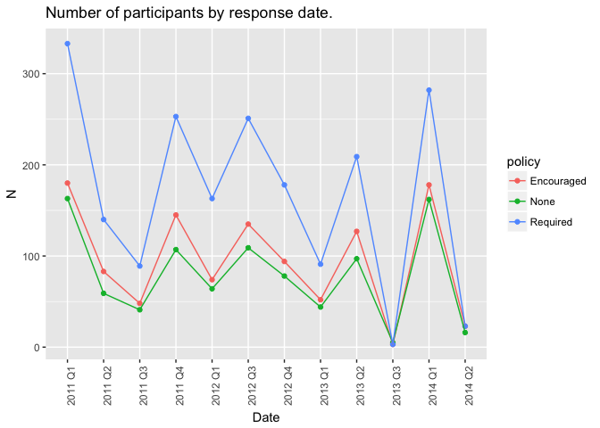<!-- -->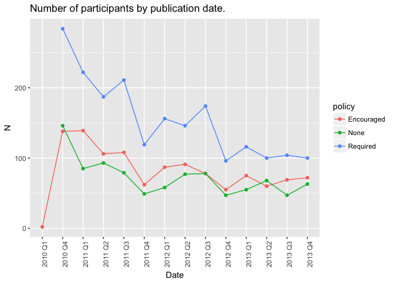<!-- -->


# Introduction
Some researchers are sceptical regarding data archiving. We conducted a survey in order to find out how the adoption of data archiving policies by journals affects researcher's attitudes towards archiving and sharing data.

# The Survey

## Method

<!-- load and prepare data -->


The survey was carried out using [Survey Monkey](www.surveymonkey.com). Invitations to participate were sent out monthly between February 2011 and March 2014 to a selection of between $605$ and $4763$ (with an average of $2168$) authors of recently published articles in a pre-selected sample of journals. 
<!-- TODO: how were the journals selected -->
The invitations were sent out to a total of $23853$ authors, and $4102$ responded (corresponding to a non-response rate of $17$\%).
Figure 1 shows the numbers of invitations and responses by the date of the author's last publication.
Participants filled in a questionnaire consisting of 15 multiple-choice questions regarding their attitudes, concerns and experiences with data archiving and sharing.

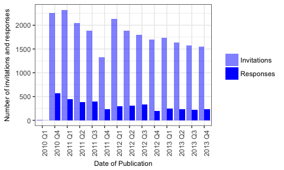

<!-- TODO: how were the responses spread out over journal types? when was the JDAP introduced when it was introduced, mean and SD? -->


## Results

In the following, I will present an overview of the responses to questions 1, 2, and 9. The questions asked about the strength of agreement/disagreement with the following statements:

* _Question 1_ It is the community norm in my field to share, with qualified researchers, datasets that support the results of peer-reviewed research articles. Include data sharing that occurs by any mechanism (e.g. emailing datasets upon request, posting datasets to lab websites, including datasets in journal supplementary information or data repositories).
* _Question 2_ It is the community norm in my field to publicly archive all supporting datasets online, for use by anyone for any purpose, upon publication of a peer-reviewed research article.
* _Question 9_ I would seek alternative journals if JDAP was introduced.

---

The following plots show the responses regarding the attitudes towards data sharing and archiving for participants who (i) published in journals which have note adopted the JDAP so far ('No JDAP'), (ii) published in journals which had not _yet_ adopted the JDAP before publication ('Before JDAP'), and (iii) journals which had adopted the JDAP before publication ('After JDAP).

<!-- -->


### Inferential statistics


The potential effect of JDAP adoption on authors' attitudes is might be confounded by two other factors. Firstly, groups of researchers publishing in journals which are not planning to adopt the JDAP (or at least have not done so yet) may inherently differ from groups publishing in journals which were open to adopting the JDAP. Secondly, attitudes regarding data archiving may improve over time. 

In order to test for an effect of policy change on attitudes while controlling for potential confounding effects, we used an ordinal logistic regression model with three predictors: (i) journal type _(cNonJDAPJournal)_, (ii) (centered) publication date in years _(cDate)_, and (iii) a variable indicating whether the article was published after the the journal adopted a data archiving policy _(cAfterPolicyChange)_.

The following table shows the estimated coefficients and 95\%-confidence intervals (transformed to odds ratios) for responses to *question 1*. Effects are statistically significant at the $\alpha=0.05$ level when the transformed confidence intervals do not contain $1$. Confidence intervals were obtained by profile likelihood. According to the model estimates, the introduction of the JDAP data archiving policy significantly increases the odds of a positive response regarding *data sharing* by a factor of $1.36$ (CI=$[1.16; 1.60]$), while the remaining two predictors do not show any statistically significant effects.


We conducted two likelihood-ratio tests to assess the effect of change in policy and the other predictors on reported attitudes. The first likelihood-ratio test, comparing the full three-predictor model with a reduced model _without_ the effect of policy change revealed a significantly better fit for the full model ($\chi^2(1)=79.38$, $p<0.001$). A second likelihood-ratio test comparing the full model with a reduced model using _only_ the policy change predictor (_cAfterPolicyChange_) revealed no statistically significantly difference ($\chi^2(2)=7.76$, $p=0.02$).

<!-- http://kbroman.org/knitr_knutshell/pages/figs_tables.html -->

                        OR   2.5 %   97.5 %      t
-------------------  -----  ------  -------  -----
cAfterPolicyChange    2.13    1.80     2.52    8.9
cNonJDAPJournal       1.15    1.00     1.32    2.0
cDate                 0.93    0.88     0.99   -2.3

The following table shows the estimated coefficients and 95\%-confidence intervals (transformed to odds ratios) for responses to *question 2*. According to the model estimates, the introduction of the JDAP data archiving policy significantly increases the odds of a positive response regarding *data archiving* by a factor of $1.57$ (CI=$[1.33; 1.90]$), while the remaining two predictors do not show any statistically significant effects.

Here too, we conducted two likelihood-ratio tests to assess the effect of change in policy and the other predictors on reported attitudes. The first likelihood-ratio test, comparing the full three-predictor model with a reduced model _without_ the effect of policy change revealed a significantly better fit for the full model ($\chi^2(1)=148.35$, $p<0.001$). A second likelihood-ratio test comparing the full model with a reduced model using _only_ the policy change predictor (_cAfterPolicyChange_) revealed no statistically significantly difference ($\chi^2(2)=9.37$, $p=0.01$).


                        OR   2.5 %   97.5 %       t
-------------------  -----  ------  -------  ------
cAfterPolicyChange    2.79    2.36      3.3   12.11
cNonJDAPJournal       1.24    1.08      1.4    3.04
cDate                 0.97    0.92      1.0   -0.89


# Appendix

## Appendix A: Questionnaire Structure
<!-- TODO: Add response options below. -->

How strongly do you disagree/agree with the following statements? (Regarding the next two questions.)

<!-- Field: Q4 -->
1. It is the community norm in my field to share, with qualified researchers, datasets that support the results of peer-reviewed research articles. Include data sharing that occurs by any mechanism (e.g. emailing datasets upon request, posting datasets to lab websites, including datasets in journal supplementary information or data repositories).

<!--
_(Strongly Agree - Agree - Somewhat Agree - Neutral - Somewhat Disagree - Disagree - Strongly Disagree)_
-->

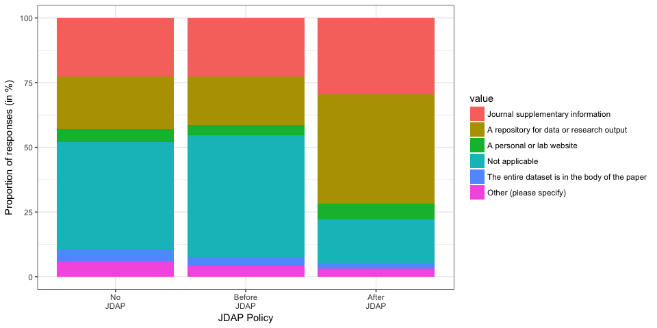<!-- -->

<!-- Field: Q5 -->
2. It is the community norm in my field to publicly archive all supporting datasets online, for use by anyone for any purpose, upon publication of a peer-reviewed research article.

<!--
_(Strongly Agree - Agree - Somewhat Agree - Neutral - Somewhat Disagree - Disagree - Strongly Disagree)_
-->

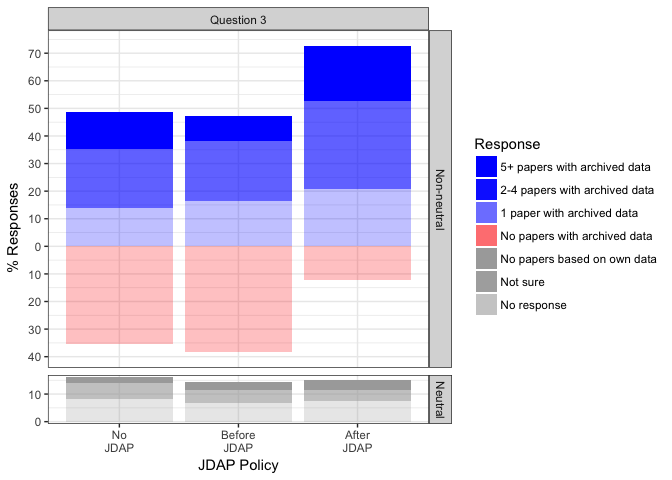<!-- -->

<!-- Field: Q7 -->
3. Do any of your published research papers have publicly archived datasets?
  a. Yes, datasets from <b>5 or more papers</b> are publicly available on the internet
  b. Yes, datasets from <b>2-4 papers</b> are publicly available on the internet
  c. Yes, a dataset from <b>one paper</b> is publicly available on the internet  
  d. No, none of my paper-related datasets are publicly available on the internet
  e. I've never published a paper based on a dataset collected by me or my co-authors
  f. I'm not sure if any of my papers have publicly available datasets


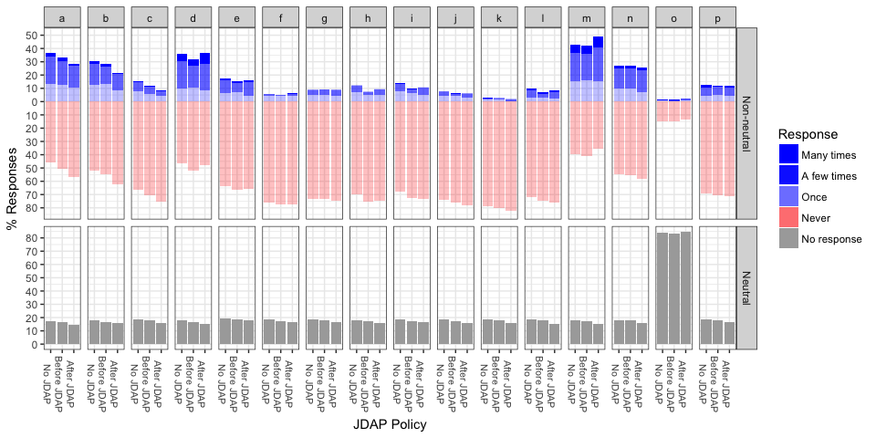<!-- -->

<!-- Field: Q9 -->
4. To your knowledge, how often have you experienced the following situations as a result of sharing the datasets behind your published research with investigators outside your research groups? Include experiences from datasets shared outside your research groups through any mechanism, including public archiving, selected distribution, or shared individually upon request (for example, in response to an email request).
  a.  I formed new collaborations <!-- Field: Q9_1 / Q_4_1 -->
	b.  I formed new collaborations that led/are leading to publications <!-- Field: Q9_2 / Q_4_2 -->
	c.  I formed new collaborations that led/are leading to grants <!-- Field: Q9_3 / Q_4_3 -->
	d.  Others have used my datasets and formally cited me <!-- Field: Q9_4 / Q_4_4 -->
	e.  Others have used my datasets but did not formally cite me <!-- Field: Q9_5 / Q_4_5 -->
	f.  Others have found errors in my research through my datasets <!-- Field: Q9_7 / Q_4_6 -->
	g.  Others misinterpreted my datasets or used them inappropriately <!-- Field: Q9_8 / Q_4_7 -->
	h.  I have had ongoing research projects scooped by another scientist <!-- Field: Q9_9 / Q_4_8 -->
	i.  I have had future research plans scooped by another scientist <!-- Field: Q9_10 / Q_4_9 -->
	j.  The ability of a junior colleague in my group (graduate student, postdoctoral fellow, or junior faculty member) to publish subsequent research has been compromised <!-- Field: Q9_11 / Q_4_10 -->
	k.  My ability to receive commercial benefit from my research has been diminished <!-- Field: Q9_12 / Q_4_11 -->
	l.  I spent a lot of money preparing data for sharing <!-- Field: Q9_13 / Q_4_12 -->
	m.  I spent a lot of time preparing data for sharing <!-- Field: Q9_14 / Q_4_13 -->
	n.  I spent a lot of time answering questions from qualified researchers about my shared data <!-- Field: Q9_15 / Q_4_14 -->
	o.  Other (please specify) <!-- Field: Q9_16 - Q9_16_TEXT / Q_4_15 - Q_4_15_TEXT -->
  p.  I spent a lot of time answering questions from unqualified researchers about my shared data <!-- Field: Q9_17 / Q_4_16 -->

<!--
  Response Options:
  1. Many times
  2. A few times
  3. Once
  4. Never
-->

<!-- -->

And again, this time limited to people with at least one paper with archived data:

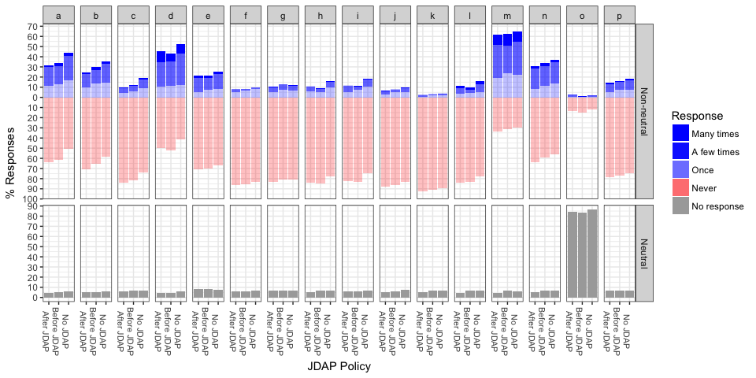<!-- -->

And one more time, for people with no archived data:

And again, this time limited to people with at least one paper with archived data:

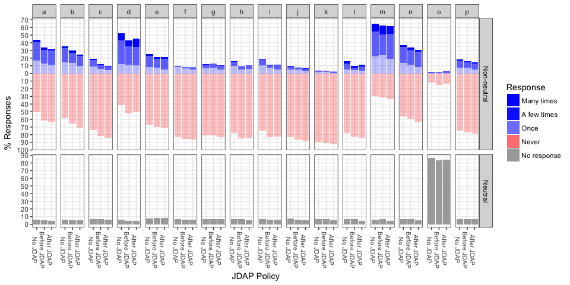<!-- -->
<!-- Field: Q11-->
5. To your knowledge, what are the policies of these stakeholders as they apply to online public archiving of the datasets associated with your (month) (year) publication in (journal)? Choose all that apply
	a.  The journal  <!-- Field: Q11_1 -->
	b.  Your funder(s)  <!-- Field: Q11_2 -->
	c.  Your employer or institution  <!-- Field: Q11_3 -->
  

<!-- -->

<!-- Field: Q12 -->
6. Are all datasets associated with your (month) (year) publication in (journal) publicly available online?

Response options:
	a.  ALL datasets are publicly available online   <!-- Field: Q12_1 -->
	b.  SOME but not all of the datasets are publicly available online   <!-- Field: Q12_2 -->
	c.  NONE of the datasets are publicly available online   <!-- Field: Q12_3 -->
	d.  I don't know   <!-- Field: Q12_4 -->
	e.  We did not collect any data for that publication   <!-- Field: Q12_5 -->
	f. Other (please specify)   <!-- Field: Q12_6/Q12_6_TEXT -->


  
<!-- Field: Q13 -->
7. IF ALL or SOME datasets associated with this paper are publicly available, where are the datasets hosted?
	a.  Journal supplementary information   <!-- Field: Q13_1 -->
	b.  A repository for data or research output   <!-- Field: Q13_2 -->
	c.  A personal or lab website   <!-- Field: Q13_3 -->
	d.  The entire dataset is in the body of the paper   <!-- Field: Q13_4 -->
	e.  Other (please specify)   <!-- Field: Q13_5/Q13_5_TEXT -->
	f.  Not applicable   <!-- Field: Q13_6 -->
  
  
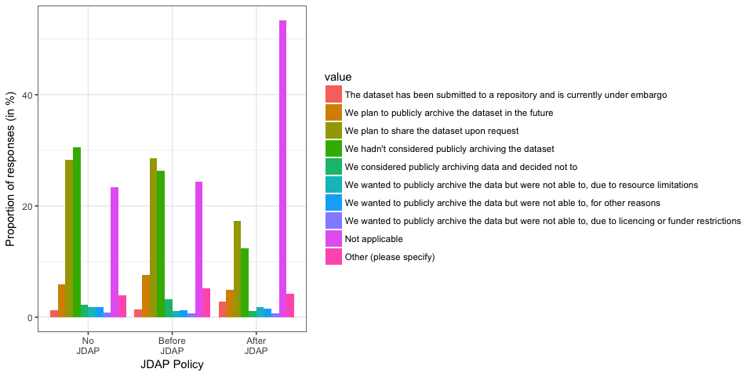<!-- -->

<!-- Field: Q14 -->
8. If NONE or only SOME of the datasets are publicly available, which of the following reflect your experience for the dataset(s) not publicly available, for this paper? Choose all that apply.
	a.  The dataset has been submitted to a repository and is currently under embargo  <!-- Field: Q14_1 -->
	b.  We plan to publicly archive the dataset in the future  <!-- Field: Q14_2 -->
	c.  We plan to share the dataset upon request  <!-- Field: Q14_3 -->
	d.  We hadn't considered publicly archiving the dataset  <!-- Field: Q14_4 -->
	e.  We considered publicly archiving data and decided not to  <!-- Field: Q14_5 -->
	f.  We wanted to publicly archive the data but were not able to, due to resource limitations  <!-- Field: Q14_6 -->
	g.  We wanted to publicly archive the data but were not able to, for other reasons  <!-- Field: Q14_7 -->
	h.  Other (please specify)  <!-- Field: Q14_8/Q14_8_TEXT -->
	i.  Not applicable  <!-- Field: Q14_9 -->
	j.  We wanted to publicly archive the data but were not able to, due to licencing or funder restrictions  <!-- Field: Q14_10 -->
  
  
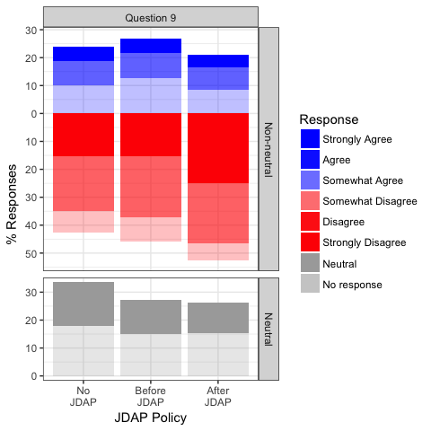<!-- -->
  
The questions below refer to the Joint Data Archiving Policy, an example policy statement adopted by ... <!-- TODO -->

<!-- Field: Q17 -->
9. How strongly do you disagree/agree with this statement? I would seek alternative journals if I learned that my target journal had adopted the Joint Data Archiving Policy (above).

<!--
Response options:
  i. Strongly Agree
  ii. Agree
  iii. Somewhat Agree
  iv. Neutral
  v. Somewhat Disagree
  vi. Disagree
  vii. Strongly Disagree
-->

<!-- -->


<!-- Field: Q18 -->
10. Imagine you just found a great journal to target when submitting your next manuscript. You read the Instruction to Authors and discover the journal adheres to the Joint Data Archiving Policy (above). How strongly do you disagree/agree with the following statements? I am worried that ...
	a.  others might do research I am currently working on  <!-- Field: Q18_1 -->
	b.  others might do research I am planning to do  <!-- Field: Q18_2 -->
	c.  others might find errors in my research  <!-- Field: Q18_3  -->
	d.  others might misinterpret my dataset or use it inappropriately  <!-- Field: Q18_4 -->
	e.  I/we might be bothered with a lot of questions by qualified people  <!-- Field: Q18_5 -->
	f.  I/we might be bothered with a lot of questions by unqualified people  <!-- Field: Q18_6 -->
	g.  I/we might not be able to find the data  <!-- Field: Q18_7 -->
	h.  it might take me/us a lot of time to find the data  <!-- Field: Q18_8 -->
	i.  it might take me/us a lot of time to format or document the data  <!-- Field: Q18_9 -->
	j.  it might take me/us a lot of time to submit the data  <!-- Field:  Q18_10-->
	k.  I might lose intellectual property or commercial opportunities  <!-- Field: Q18_11 -->
	l.  Other worries (please specify)  <!-- Field: Q18_12/Q18_12_TEXT -->


<!-- -->


<!-- Field: Q19 -->
11. Same instructions as the previous question: Imagine you just found a great journal to target when submitting your next manuscript. You read the Instruction to Authors and discover the journal adheres to the Joint Data Archiving Policy (above). How strongly do you disagree/agree with the following statements? I am pleased because...
	a.  others will build upon my work more easily  <!-- Field: Q19_1  -->
	b.  I will get more citations  <!-- Field: Q19_2  -->
	c.  I will form more collaborations  <!-- Field: Q19_3  -->
	d.  the contribution will be valued by my promotion or tenure committee  <!-- Field: Q19_4  -->
	c.  the contribution will be valued by my funders  <!-- Field: Q19_5  -->
	d.  I will be able to reuse other work more easily  <!-- Field: Q19_6  -->
	e.  I will be able to reuse other work more often  <!-- Field: Q19_7  -->
	f.  my scientific area will progress more quickly  <!-- Field: Q19_8  -->
	g.  my scientific area will develop better tools and/or training  <!-- Field: Q19_9  -->
	h.  I think it is the right thing to do  <!-- Field: Q19_10  -->
	i.  Other (please specify)  <!-- Field: Q19_11/Q19_11_TEXT  -->


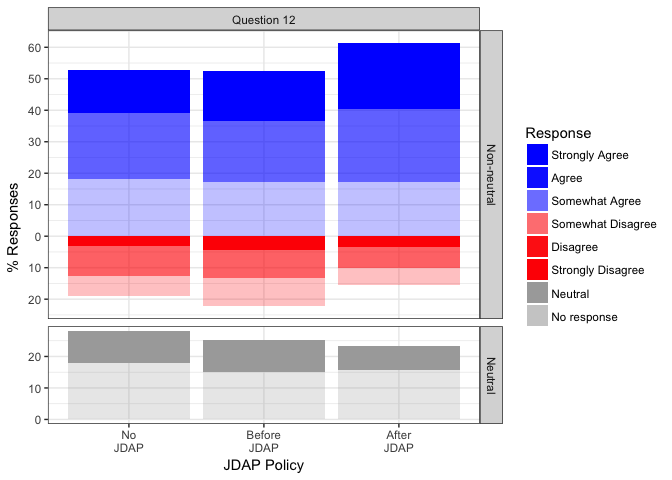<!-- -->

How strongly do you disagree/agree with the following statements?

<!-- Field: Q21 -->
12.  Using datasets collected by investigators outside my research group is important in my research.

<!-- -->


<!-- Field: Q22 -->
13. Using datasets collected by investigators outside my research group is important in my teaching or other non-research projects.

<!-- -->

<!-- Field: Q23/Q23_TEXT -->
14. Please choose the title that most closely matches yours:
     
<!-- Field: Q25 -->
15. Do you have any comments on the topic, or suggestions for how to improve this questionnaire?

<!-- Field: Q26 -->
16. Thank you for completing this survey! If you would like to enter the drawing for a $20 Amazon gif... <!-- TODO -->


## Appendix B: JDAP Adoption Dates


Journal                                                   Adoption Date of JDAP or Equivalent Policy 
--------------------------------------------------------  -------------------------------------------
American Naturalist                                       01.01.2011                                 
Biological Journal of the Linnean Society                 18.09.2010-03.09.2011                      
Biology Letters                                           01.09.2014-29.10.2014                      
Ecological Applications                                   01.01.2014                                 
Ecological Monographs                                     01.01.2011                                 
Evolution                                                 01.01.2011                                 
Evolutionary Applications                                 01.01.2011                                 
Functional Ecology                                        05.10.2012-5.12.2012                       
GENETICS                                                  01.01.2010                                 
Heredity                                                  01.03.2011                                 
Journal of Animal Ecology                                 01.12.2012                                 
Journal of Ecology                                        5.5.2013 - 3.6.2013                        
Journal of Evolutionary Biology                           24.8.2011 <e2><80><93> 24.10.2011                   
Journal of Heredity                                       01.01.2013                                 
Molecular Biology and Evolution                           01.01.2010-31.12.2010                      
Molecular Ecology                                         01.01.2011                                 
Oikos                                                     <06.03.2014                                
PLoS Biology                                              12.10.2014-14.11.2014                      
Systematic Biology                                        01.01.2010-31.12.2010                      
BMC Biology                                               >19.08.2014                                
Genome research                                           <06.07.2008                                
New Phytologist                                           <23.11.2010                                
Proceedings of the Royal Society B: Biological Sciences   <20.03.2013                                
The Plant Journal                                         < 18.08.2010                               

## Bibliolography


