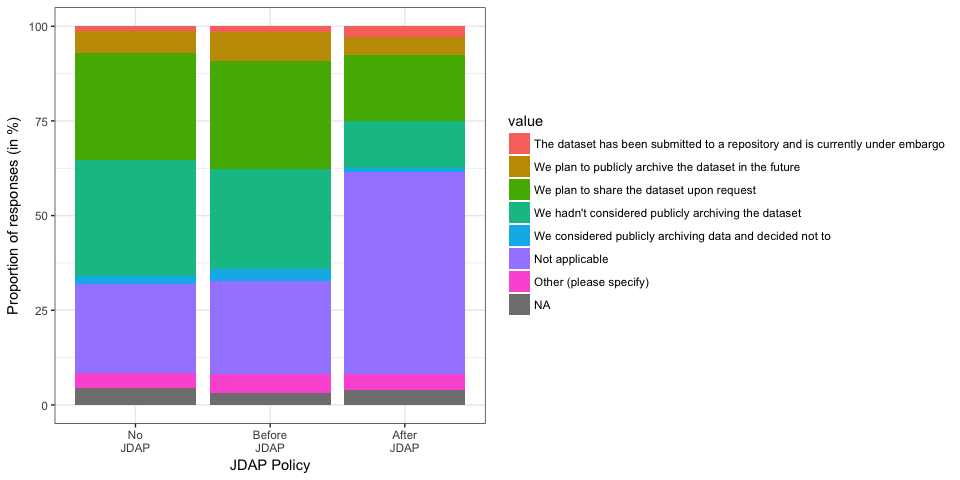
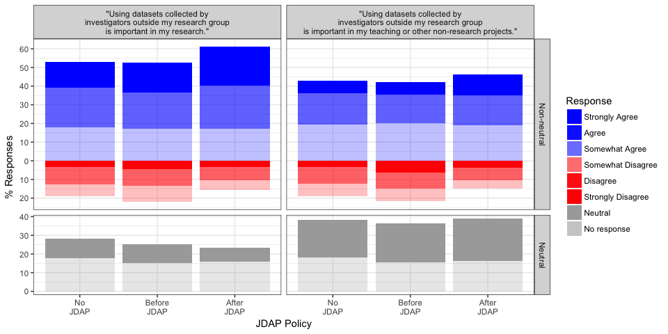
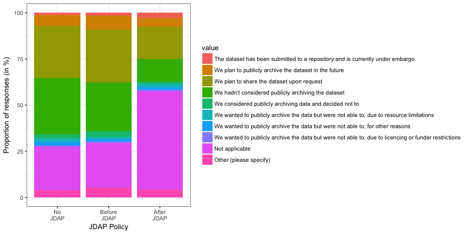
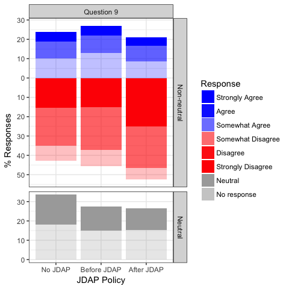

Abstract
========

Introduction
============

There have been previous studies of data sharing patterns, but we are not aware of any prior research that examined attitudes and experiences of authors before and after policy implementation.

Data archiving policies
-----------------------

Sharing data is a tenet of science, yet commonplace in only a few subdisciplines. Publicly available datasets have many potential reuses. Unfortunately, these advantages only indirectly benefit the stakeholders who bear most of the costs for sharing their datasets: the primary data-producing investigators. As a result, authors often actively or passively withhold their research datasets from other investigators
(Blumenthal et al., 1997; Ochsner et al., 2008; Savage & Vickers, 2009).

Recognizing that a data sharing culture is unlikely to be achieved without policy guidance, funders and journals have begun to request and require that investigators share their research datasets with other researchers (Brown, 2003; Enriquez et al., 2010). Funders are motivated by the promise of resource efficiency and rapid progress. The motivation for journals to act as an advocate and gatekeeper for data sharing is less straightforward. Journals seek to publish “well-written, properly formatted research that meets community standards” and in so doing have assumed monitoring tasks to “remind researchers of community expectations and enforce some behaviors seen as advantageous to the progress of science” (McCain, 1995). This role has been encouraged by many letters, white-papers, and editorials in high-profile journals.

Policies should only be adopted if their benefits outweigh their costs, across the wide array of stakeholders (Foster & Sharp, 2007). Requiring data sharing can raise controversy (King, 1995; Campbell et al., 2002), increase short-term system costs (Beagrie, Eakin-Richards, & Vision, 2009), and possibly motivate authors to seek alternative locations for publishing. The goal of this study is quantify the some of the short-term benefits and costs of policy adoption in the practices, attitudes, and opinions of data producing authors.

A journal policy that requires authors to share the datasets that support their results as a condition of publication may impact the practices, attitudes, and opinions of data producing authors in many ways. The most direct impact is likely a change in frequency of data sharing, and a shift to data archiving locations specified in the policy. Early studies suggest that authors who publish in journals with data sharing policies are more likely to share their data than authors who publish similar studies in similar journals (HA Piwowar & Chapman, 2008; Piwowar, 2011), but these investigations were correlative and did not attempt to directly measure the impact of journal policies over time. Previous work emphasizes the importance of sharing data through best-practice archiving methods and locations. Authors who share data upon request often discriminate against use and users (Reidpath & Allotey, 2001; P. Campbell, 2008). The permanence of data sharing mechanisms is also a concern; email and lab-website based sharing choices have been shown to be impermanent solutions at best (J. Wren, Grissom, & Conway, 2006; J. D. Wren, 2008).

An question of particular interest is whether the adoption of data sharing mandates leads authors to perceive that it has become a community norm to share data in their field. If so, this shift in attitude may in and of itself it may lead to more data sharing: previous research has found that scientists “look beyond their individual interests to social cues from reference groups when deciding whether to withhold or share information requested by others” (Haas & Park, 2009). This is consistent with findings that have found a correlation between information sharing and perceived community norm of openness and sharing (Kuo & Young, 2008; Haeussler & München, 2011), as well as evidence that a scientist’s sharing decisions are influenced by expectation of reciprocity (Gouldner, 1957) and that their prior experiences with sharing predicts future sharing decisions (E. G. Campbell & Bendavid, 2002).

A few previous studies have estimated the impact of sharing data on the experiences of authors (Gleditsch & Strand, 2003; Ventura, 2005; Blumenthal et al., 2006; H Piwowar, Day, & Fridsma, 2007), but there is much to be learned in this area to ground expectations, accurately estimate costs and benefits, and learn about ways policies could be improved to enhance positive experiences and avoid negative ones.

Journal publishers and editors may be particularly interested in whether authors start to view data sharing mandates more positively after they have experience with them. In particular, knowing whether experience with a data sharing policy makes authors more or less likely include the existence of data sharing policies in their decisions about future publishing venues (Björk & Öörni, 2009) would be of great interest to journals considering the adoption of such policies.

Evaluating the impact of a journal data sharing policy on dataset reuse is also critical. Such an evaluation would require a longer timeframe than that of the current proposal and may be felt most strongly in a different author population; we hope to pursue this area in future work.

Upcoming policy change is a useful opportunity for policy evaluation
--------------------------------------------------------------------

Several journals plan to adopt the Joint Data Archiving Policy in early 2011, as described at <http://datadryad.org/jdap>.

This is a great opportunity to study the effect of journal data sharing mandates on the attitudes, behaviour, experiences of authors to help inform future policy decisions.

The JDAP policy requires data sharing in a public archive. Early evidence suggests stronger policies are associated with a higher frequency of data sharing (HA Piwowar & Chapman, 2008; Piwowar, 2011). Since JDAP requires data sharing as a condition of publication, studying this policy adoption is an opportunity to possibly measure the maximum likely effect. Also, since the adopting journals include almost all of the high-impact journals in the field of Evolutionary Science (as per the 2009 ISI JCR), it is likely that even authors who dislike the policies will continue publishing in these journals and possibly participate in our measurement of opinions.

We note that authors in evolution and ecology have been surveyed several other times to assess data sharing attitudes and experiences, but these questionnaires have not been correlated to journal policy adoption (Scherle et al., 2008).

Because measurements of actual dataset archiving behavior can be accurately measured with a retrospective analysis of research artifacts, our proposed survey does not emphasize data archiving behaviour. Instead, the questionnaire will focus on information that is difficult or impossible to collect without a timely survey of data-producing investigators.

Rigorous research is needed into the impact of journal policies
---------------------------------------------------------------

Although some data sharing mandates appear to have achieved almost universal sharing (M. Noor, Zimmerman, & Teeter, 2006), this is not always the case (**???**). Several surveys have asked about author’s perceived obstacle to sharing data (**???**; Hedstrom & Niu, 2008), but changes in these attitudes have not been monitored across a policy change. To our knowledge, the impact of data sharing mandates have only been subject to one evaluation: the editors of Physiological Genomics briefly surveyed their authors and reviewers two years after instituting a policy that required public archiving of gene expression microarray data (**???**), though unfortunately no baseline measurements are available about attitudes before the policy. Interestingly, a recent large-scale evaluation (**???**) into the prevalence of microarray data sharing found this same journal to have the highest rate of public archiving.

Robust studies of journal policies are infrequent, even in areas beyond data sharing. A systematic review in 2006 examined the effect of journal adoption of CONSORT requirements for standard reporting of clinical trials (Plint et al., 2006). It found that most publications about the journal policies were editorials or letters (699 of 1129 articles about the CONSORT policy). Of the studies, many were non-comparative (231 of 248), only a very few (12) were considered to be comparative studies with appropriate outcomes and sufficient detail, and only one study had predefined control group. The authors conclude that, “Studies evaluating the effectiveness of the CONSORT checklist are methodologically weak” (Plint et al., 2006). This suggests that high quality evaluations are indeed rare and thus potentially valuable contributions.

Research questions
------------------

The specific research questions for this study include:

-   How do authors’ attitudes, experiences, and practices around public data archiving change when the journals they publish in adopt mandatory data archiving policies?
-   Are changes specific to the journals that implement the policies, or do they extend to other journals in the same subfield?
-   Does publishing in a journal with a mandatory data archiving policy decrease an author's willingness to publish in a journal with a mandatory data archiving policy again?

Twelve other survey questions will allow secondary and exploratory analyses.

Methods
=======

Participants were recruited from corresponding authors who publish in specific journals between November 2010 and November 2013. The responses of authors who published in JDAP-adopting journals were then compared, over time, to the responses of authors who published in similar journals that did not adopt JDAP.

The instrument used to collect data is be an online questionnaire. The questionnaire is designed to elicit the respondent’s practices, experiences, and opinions around public archiving of research datasets by asking about their opinion of community norms, recent behaviour with respect to a recently published paper, previous experiences with data sharing, and attitudes toward hypothetical journal policies

Control jounrnals and sample size
---------------------------------

The proposed study is subject to two different types of uncertainty: uncertainty about the estimation of aggregate parameters, and also “uncertainty about the ability of the control group to reproduce the counterfactual of how the treated unit would have evolved in the absence of the treatment” ((Abadie, Diamond, & Hainmueller, 2010). It was difficult to know how to conduct a formal power analysis in these conditions, so we based our sample size decisions on the following information.

For populating the “treatment arm,” we asked all corresponding authors of all JDAP-adopting journals.

For populating the “control arms,” we recognized that the uncertainty is predominantly determined by the applicability of the controls. Little information is currently available to determine, a priori, which journals will serve as appropriate controls. As such, we decided that surveying twice as many control journals as treatment journals was an appropriate rule of thumb. This balanced the need to avoid overpowering the study (and thereby increasing survey-fatigue and effort) with a desire to ensure the most useful results (anticipating that unexpected future events may render some controls inappropriate during the three years of this study, as well as recognizing that the quality of inference improves as the number of available comparison units increases (Abadie, Diamond, & Hainmueller, 2010).

Control journals were selected by manual selection from a set of journals identified through ISI Journal Citation report categories as well as co-citation lists. Attempts were made to choose journals with comparable impact factors and inclination to produce quantitative datasets.

Assuming a 20% response rate and a control arm that was twice as large as the treatment arm, we expected a maximum of 165 responses per month, or almost 6000 responses over the course of the three year study. The actual number of responses was expected to be lower than this because only invited each corresponding author the first time they published a paper.

Journal editors were informed of the survey before it began and given contact information in case they had questions, suggestions, or concerns.

Participant recruitment
-----------------------

Participants were recruited from corresponding authors who published in specific journals between November 2010 and November 2013. Specifically, email addresses were collected for papers published the previous month (or 3 previous months, for the initial month of recruitment) in each of the target journals through the ISI Web of Science. No other identifying information (author names, article title, etc) was retained.

The email invitation included a URL where subjects can learn more about the study and then read a fact sheet, consent, and participate if they choose. This email contained contain an “opt out” option, which will remove their address from the reminder list. Those who did not “opt out” were contacted by email again, a week later, politely asking them to take the survey if they haven’t already.

Recruitment email lists were compared across months, and emails only sent to those who have not previously received a recruitment email to reduce survey fatigue and ill-will.

The online survey was administered through Qualtrics, hosted by the University of North Carolina. The online questionnaire took about 10 minutes to complete.

Analysis approach
-----------------

The primary analysis will be based on responses to be a seven-point Likert scale asking how strongly authors believe: “It is the community norm in my field to publicly share datasets upon study publication by archiving all datasets online, for use by anyone for any purpose.” Our goal is to see if author's responses to this question were influenced by publishing in a journal that had implemented JDAP.

The potential effect of JDAP adoption on authors' attitudes is might be confounded by two other factors. First, groups of researchers publishing in journals which are not planning to adopt JDAP may inherently differ from groups publishing in journals which were open to adopting the JDAP. Second, attitudes regarding data archiving may improve over time for all authors, independent of journal or policy.

In order to test the effect of policy change on attitudes while controlling for potential confounding effects, we used an ordinal logistic regression model with three predictors: (i) whether the jounal adopted JDAP *(cNonJDAPJournal)*, (ii) the date the authors published their paper *(cDate)*, and (iii) a variable indicating whether the article was published after the the journal adopted a data archiving policy *(cAfterPolicyChange)*. Confidence intervals were obtained by profile likelihood. If the confidence intervals do not contain 1 for the *(cAfterPolicyChange)* variable then the policy would have had an affect on attitudes, independent of publication date or whether the journal was the type to adopt a JDAP policy.

We further tested the policy correlation by comparing the fit of two models, one model with all three of the above variables, and one model with two variables excluding the policy change predictor (*cAfterPolicyChange*). If, using a likelihood-ratio test, the full model was a statistically better fit than the model without the policy change variable, it would support the hypothesis that the differences in authors attitudes were related to the policy adoption.

Twelve other survey questions allowed secondary and exploratory analyses.

Results
=======

Response rate
-------------

The invitations were sent out monthly between February 2011 and March 2014 to a total of 23853 authors, and 4102 responded (corresponding to a response rate of 17%).

| position               | number of responses | proprotion of responses |
|------------------------|---------------------|-------------------------|
| postdoc                | 1049                | 0.254                   |
| tenured faculty        | 986                 | 0.239                   |
| (blank)                | 696                 | 0.169                   |
| research staff         | 470                 | 0.114                   |
| non-tenured faculty    | 463                 | 0.112                   |
| student                | 343                 | 0.083                   |
| Other (please specify) | 117                 | 0.028                   |
| Grand Total            | 4124                | 1                       |

Journal policies as of December 2014 (surveys were sent out between February 2011 and March 2014 to authors who published between November 2010 and November 2013):

| journal                                                 | policy start | number of responses |
|---------------------------------------------------------|--------------|---------------------|
| American Naturalist                                     | 2011-01-01   | 115                 |
| Animal Behaviour                                        |              | 129                 |
| Behavioral Ecology                                      |              | 62                  |
| Behavioral Ecology and Sociobiology                     |              | 78                  |
| Biological Conservation                                 |              | 134                 |
| Biological Journal of the Linnean Society               | 2011-09-03   | 102                 |
| Biology Letters                                         | 2014-10-29   | 80                  |
| BMC Biology                                             | 2014-08-19   | 22                  |
| BMC Evolutionary Biology                                |              | 102                 |
| BMC Plant Biology                                       |              | 53                  |
| Conservation Biology                                    |              | 71                  |
| Conservation genetics                                   |              | 64                  |
| Ecological Applications                                 | 2014-01-01   | 115                 |
| Ecological Monographs                                   | 2011-01-01   | 25                  |
| Ecology                                                 |              | 156                 |
| Evolution                                               | 2011-01-01   | 115                 |
| Evolutionary Applications                               | 2011-01-01   | 22                  |
| Evolutionary Ecology                                    |              | 38                  |
| FASEB Journal                                           |              | 143                 |
| FEBBS Letters                                           |              | 113                 |
| Functional Ecology                                      | 2012-12-05   | 59                  |
| GENETICS                                                | 2010-01-01   | 95                  |
| Genome research                                         | 2008-07-06   | 70                  |
| Global Change Biology                                   |              | 124                 |
| Heredity                                                | 2011-03-01   | 42                  |
| ISME Journal                                            |              | 66                  |
| Journal of Animal Ecology                               | 2012-12-01   | 68                  |
| Journal of Biogeography                                 |              | 70                  |
| Journal of Ecology                                      | 2013-06-03   | 74                  |
| Journal of Evolutionary Biology                         | 2011-10-24   | 96                  |
| Journal of Experimental Biology                         |              | 179                 |
| Journal of Experimental Botany                          |              | 123                 |
| Journal of Heredity                                     | 2013-01-01   | 32                  |
| Journal of Molecular Evolution                          |              | 23                  |
| Journal of Paleontology                                 |              | 34                  |
| Molecular Biology and Evolution                         | 2010-12-31   | 104                 |
| Molecular Ecology                                       | 2011-01-01   | 154                 |
| Molecular Phylogenetics and Evolution                   |              | 83                  |
| Nature structural & molecular biology                   |              | 50                  |
| New Phytologist                                         | 2010-11-23   | 80                  |
| Oecologia                                               |              | 151                 |
| Oikos                                                   | 2014-03-06   | 118                 |
| Paleobiology                                            |              | 2                   |
| Physiological Genomics                                  |              | 38                  |
| PLoS Biology                                            | 2014-11-14   | 82                  |
| Proceedings of the Royal Society B: Biological Sciences | 2013-03-20   | 217                 |
| Systematic Biology                                      | 2010-12-31   | 26                  |
| The Plant Journal                                       | 2010-08-18   | 102                 |

Primary analysis
----------------

### Attitudes on data sharing and data archiving norms

The questions asked about the strength of agreement/disagreement with the following statements:

-   It is the community norm in my field to share, with qualified researchers, datasets that support the results of peer-reviewed research articles. Include data sharing that occurs by any mechanism (e.g. emailing datasets upon request, posting datasets to lab websites, including datasets in journal supplementary information or data repositories).
-   It is the community norm in my field to publicly archive all supporting datasets online, for use by anyone for any purpose, upon publication of a peer-reviewed research article.

------------------------------------------------------------------------

The following plots show the responses regarding the attitudes towards data sharing and archiving for participants who (i) published in journals which have note adopted the JDAP so far ('No JDAP'), (ii) published in journals which had not *yet* adopted the JDAP before publication ('Before JDAP'), and (iii) journals which had adopted the JDAP after publication ('After JDAP).

The following plots show the responses regarding the attitudes towards data sharing and archiving for participants who (i) published in journals which have note adopted the JDAP so far ('No JDAP'), (ii) published in journals which had not *yet* adopted the JDAP before publication ('Before JDAP'), and (iii) journals which had adopted the JDAP after publication ('After JDAP).

According to the model estimates, the introduction of the JDAP data archiving policy significantly increases the odds of a positive response regarding *data sharing* by a factor of 1.36 (CI=\[1.16; 1.60\]), while publishing date and whether the journal ever adopted a JDAP policy did not show any statistically significant effects. The estimated coefficients and confidence intervals are shown below.

The result of two likelihood-ratio tests supported these findings. The first likelihood-ratio test, comparing the full three-predictor model to a reduced model *without* the effect of policy change revealed a significantly better fit for the full model (*χ*2(1)=79.38, *p* &lt; 0.001), suggesting that the date of publication and whether a journal adopted JDAP are not as important in to an author's opinion about *data sharing* the data as whether the author published after a JDAP policy was introduced.

<!-- http://kbroman.org/knitr_knutshell/pages/figs_tables.html -->
|                    |    OR|  2.5 %|  97.5 %|     t|
|--------------------|-----:|------:|-------:|-----:|
| cAfterPolicyChange |  2.13|   1.80|    2.52|   8.9|
| cNonJDAPJournal    |  1.15|   1.00|    1.32|   2.0|
| cDate              |  0.93|   0.88|    0.99|  -2.3|

We found the similar results when we looked at the author's responses to community norms about *data archiving* rather than data sharing. The following table shows the estimated coefficients and 95%-confidence intervals (transformed to odds ratios). According to the model estimates, the introduction of the JDAP data archiving policy significantly increases the odds of a positive response regarding *data archiving* by a factor of 1.57 (CI=\[1.33; 1.90\]). Being a nonJDAP journal is a significant predictor in this case, though with a much lower odds ratio.

Comparing the full three-predictor model with a reduced model *without* the effect of policy change revealed a significantly better fit for the full model (*χ*2(1)=148.35, *p* &lt; 0.001), indicating again that the policy change was a statistically significant predictor of the author's responses about data archiving attitudes.

|                    |    OR|  2.5 %|  97.5 %|      t|
|--------------------|-----:|------:|-------:|------:|
| cAfterPolicyChange |  2.79|   2.36|     3.3|  12.11|
| cNonJDAPJournal    |  1.24|   1.08|     1.4|   3.04|
| cDate              |  0.97|   0.92|     1.0|  -0.89|

Exploratory analysis
--------------------

### Data sharing and archiving behavior

<!-- Field: Q12 -->
Are all datasets associated with your (month) (year) publication in (journal) publicly available online?

<!-- Field: Q13 -->
IF ALL or SOME datasets associated with this paper are publicly available, where are the datasets hosted?

<!-- Field: Q14 -->
If NONE or only SOME of the datasets are publicly available, which of the following reflect your experience for the dataset(s) not publicly available, for this paper? Choose all that apply.

<!-- Field: Q11-->
To your knowledge, what are the policies of these stakeholders as they apply to online public archiving of the datasets associated with your (month) (year) publication in (journal)? Choose all that apply

### Data archiving history

<!-- Field: Q7 -->
Do any of your published research papers have publicly archived datasets?

### Experiences with consequences of data archiving

<!-- Field: Q9 -->
To your knowledge, how often have you experienced the following situations as a result of sharing the datasets behind your published research with investigators outside your research groups? Include experiences from datasets shared outside your research groups through any mechanism, including public archiving, selected distribution, or shared individually upon request (for example, in response to an email request).

1.  I formed new collaborations <!-- Field: Q9_1 / Q_4_1 -->
    1.  I formed new collaborations that led/are leading to publications <!-- Field: Q9_2 / Q_4_2 -->
    2.  I formed new collaborations that led/are leading to grants <!-- Field: Q9_3 / Q_4_3 -->
    3.  Others have used my datasets and formally cited me <!-- Field: Q9_4 / Q_4_4 -->
    4.  Others have used my datasets but did not formally cite me <!-- Field: Q9_5 / Q_4_5 -->
    5.  Others have found errors in my research through my datasets <!-- Field: Q9_7 / Q_4_6 -->
    6.  Others misinterpreted my datasets or used them inappropriately <!-- Field: Q9_8 / Q_4_7 -->
    7.  I have had ongoing research projects scooped by another scientist <!-- Field: Q9_9 / Q_4_8 -->
    8.  I have had future research plans scooped by another scientist <!-- Field: Q9_10 / Q_4_9 -->
    9.  The ability of a junior colleague in my group (graduate student, postdoctoral fellow, or junior faculty member) to publish subsequent research has been compromised <!-- Field: Q9_11 / Q_4_10 -->
    10. My ability to receive commercial benefit from my research has been diminished <!-- Field: Q9_12 / Q_4_11 -->
    11. I spent a lot of money preparing data for sharing <!-- Field: Q9_13 / Q_4_12 -->
    12. I spent a lot of time preparing data for sharing <!-- Field: Q9_14 / Q_4_13 -->
    13. I spent a lot of time answering questions from qualified researchers about my shared data <!-- Field: Q9_15 / Q_4_14 -->
    14. Other (please specify) <!-- Field: Q9_16 - Q9_16_TEXT / Q_4_15 - Q_4_15_TEXT -->
    15. I spent a lot of time answering questions from unqualified researchers about my shared data <!-- Field: Q9_17 / Q_4_16 -->

<!--
  Response Options:
  1. Many times
  2. A few times
  3. Once
  4. Never
-->
Limited to people with at least one paper with archived data:

### Attitudes on data reuse

How strongly do you disagree/agree with the following statements?

<!-- Field: Q21 -->

### Opinions about JDAP policies

The questions below refer to the Joint Data Archiving Policy.

Imagine you just found a great journal to target when submitting your next manuscript. You read the Instruction to Authors and discover the journal adheres to the Joint Data Archiving Policy (above).

Would you seek an alternative journal?

<!-- Field: Q18 -->
Imagine you just found a great journal to target when submitting your next manuscript. You read the Instruction to Authors and discover the journal adheres to the Joint Data Archiving Policy (above). How strongly do you disagree/agree with the following statements? How strongly do you disagree/agree with the following statements? I am worried that ...

1.  others might do research I am currently working on <!-- Field: Q18_1 -->
    1.  others might do research I am planning to do <!-- Field: Q18_2 -->
    2.  others might find errors in my research <!-- Field: Q18_3  -->
    3.  others might misinterpret my dataset or use it inappropriately <!-- Field: Q18_4 -->
    4.  I/we might be bothered with a lot of questions by qualified people <!-- Field: Q18_5 -->
    5.  I/we might be bothered with a lot of questions by unqualified people <!-- Field: Q18_6 -->
    6.  I/we might not be able to find the data <!-- Field: Q18_7 -->
    7.  it might take me/us a lot of time to find the data <!-- Field: Q18_8 -->
    8.  it might take me/us a lot of time to format or document the data <!-- Field: Q18_9 -->
    9.  it might take me/us a lot of time to submit the data <!-- Field:  Q18_10-->
    10. I might lose intellectual property or commercial opportunities <!-- Field: Q18_11 -->

<!-- Field: Q19 -->
Same instructions as the previous question: Imagine you just found a great journal to target when submitting your next manuscript. You read the Instruction to Authors and discover the journal adheres to the Joint Data Archiving Policy (above). How strongly do you disagree/agree with the following statements? I am pleased because...

1.  others will build upon my work more easily <!-- Field: Q19_1  -->
    1.  I will get more citations <!-- Field: Q19_2  -->
    2.  I will form more collaborations <!-- Field: Q19_3  -->
    3.  the contribution will be valued by my promotion or tenure committee <!-- Field: Q19_4  -->
    4.  the contribution will be valued by my funders <!-- Field: Q19_5  -->
    5.  I will be able to reuse other work more easily <!-- Field: Q19_6  -->
    6.  I will be able to reuse other work more often <!-- Field: Q19_7  -->
    7.  my scientific area will progress more quickly <!-- Field: Q19_8  -->
    8.  my scientific area will develop better tools and/or training <!-- Field: Q19_9  -->
    9.  I think it is the right thing to do <!-- Field: Q19_10  -->

### Free text comments

There were 356 free text comments. A few representative ones:

-   You may wish to consider fields of research. In ecology I guard my data; for evolutionary studies I use online data. The fields have very different attitudes and approaches.
-   In ecology, we often spend years collecting datasets that are unique. That effort, combined with the set of ideas that led to collection of the data, should convey a large degree of 'ownership'.
-   Thanks for researching this question. I cannot share my data... unless someone directly requests it and guarantees shared authorship of the product. We invested tremendous amounts of money and personal effort in collecting and grooming these data, so we need to work through all the associated papers before others have a chance.
-   I think you could have more comments related to how cumbersome, time-consuming, and expensive this new requirement is to most researchers.
-   Putting the data into an archive will produce additional costs. How is going to pay for it? At the moment, we are rquested to keep the data for at least 10 years, and share them with colleagues upon request. This has worked so far, and I think we should leave it at that and not use up extra money that could be better used for funding science.
-   Science is about sharing ideas and data. If we don't do this it is not science. It's pretty simple. The only question is which datasets is it worth investing effort into sharing at what level of detail and standards. This is tricky to get the balance right but this debate should not negate the premise that we're about data sharing.
-   I personally find submitting your own data a bit tedious, and I would always be worried that someone would use arcane statistical models to contradict something I found, but in the end transparency is an important feature of science and it's ridiculous that we don't have to show our data. It is absolutely the right thing to do.

Discussion
==========

We found that more authors believed that data sharing and data archiving were norms in their field after they published in a journal with a JDAP policy.

Data archiving policies are becoming more prevalent: seven journals announced data archiving mandates during the course of the survey (and another three journals implemented policies shortly after the suvey completed).

even so, a minority of journal policies require data sharing (Naughton L, 2016; Vasilevsky et al., 2017)

Journal policies do help (Alsheikh-Ali et al., 2011; Piwowar, 2011; Vines et al., 2013), though often not sufficient to achieve data availability for the majority of studies (Alsheikh-Ali et al., 2011; Piwowar, 2011; Roche et al., 2015; Naudet et al., 2018; Stodden, Seiler, & Ma, 2018).

This suggests author personality (Linek et al., 2017) or social norms (Anagnostou et al., 2015; Womack, 2015) may play a larger factor.

Could be helpful for journals to help spread the word about worries that are unfounded. For example, authors are worried about scooping, but it rarely happens -- almost all of an author's papers about one of their own datasets occur within two years of its collection, whereas third-party papers are still accumulating six years later (H. A. Piwowar & Vision, 2013). In areas where this is less true, journal policies could be modified to support it (Sturges et al., 2015; Whitlock et al., 2016)

Similarily, the free text comments suggested authors are concerned about the cost of data archiving. It may help to spread the word that money research funders spend on data archiving is good return on investment in terms of research output (H. A. Piwowar, Vision, & Whitlock, 2011).

The longitudinal study nature of this study is useful -- comparing across journals is frought, as stronger data archiving policies are disproportionately found in higher impact journals (HA Piwowar & Chapman, 2008; Vasilevsky et al., 2017).

Our findings are consistent with previous studies that found authors were more likely to share data if they had prior experience sharing or reusing data: (Piwowar, 2011).

Several recommendations have been made for journals seeking to form a data archiving policy (Lin & Strasser, 2014; Roche et al., 2014; Sturges et al., 2015; Van Tuyl & Whitmire, 2016)

Limitations of this study include:

-   This study makes no attempt to understand the rigor with which data sharing is encouraged in journals beyond their written policies: many journals without policies nonetheless expect data sharing and many with written policies fail to enforce them.
-   The opinions of corresponding authors with respect to data sharing may not be typical of all authors: a future study could be done to quantify this.
-   Respondents may be reluctant to self-report when they do not share their datasets, particularly as their sense of sharing as a community norm increases, since survey respondents are often reluctant to report engaging in socially undesirable behavior. This may take the form of non-response, or untruthful responses.
-   It will be difficult or impossible to derive causality direction for an association between reported data sharing behaviour and reported perception of data sharing as a community norm.
-   By only inviting authors to participate the first time they are listed as corresponding authors within our study scope, the population we are polling will shift gradually over time away from highly-prolific authors.
-   Finally, this study only facilitates a relatively short-term look at policy effect: it will likely take many more years for the effect of these policies to be fully felt.

Data availability
=================

-   IRB (now in dropbox)
-   Recruitment emails (now in dropbox)
-   Journal policies (instructions to authors as of January 29, 2011): zip of html (now in dropbox)
-   Survey questions (now in dropbox)
-   [Survey responses](https://github.com/hpiwowar/jdap/blob/master/data/raw_data/JDAP_Survey_Data.csv)
-   [Full text comments](https://github.com/hpiwowar/jdap/blob/master/data/full_text_comments.txt)
-   [Contact corresponding authors scripts](https://github.com/hpiwowar/contact_corresponding)
-   [Manuscript R files](https://github.com/hpiwowar/jdap)
-   [News blog about the study](https://studyonimpactofjournaldatapolicies.wordpress.com/)

Acknowlegements
===============

Everyone who took the survey.

Funding
=======

Heather's postdoc funding.

Bibliolography
==============

Abadie, A., Diamond, A., & Hainmueller, J. 2010. *Synthetic Control Methods for Comparative Case Studies: Estimating the Effect of California’s Tobacco Control Program*. Journal of the American Statistical Association 105(490):493–505.

Alsheikh-Ali, A. A., Qureshi, W., Al-Mallah, M. H., & Ioannidis, J. P. A. 2011. *Public availability of published research data in high-impact journals*. PLoS One 6(9):e24357.

Anagnostou, P., Capocasa, M., Milia, N., Sanna, E., Battaggia, C., Luzi, D., & Destro Bisol, G. 2015. *When data sharing gets close to 100%: What human paleogenetics can teach the open science movement*. PLoS One 10(3):e0121409.

Beagrie, N., Eakin-Richards, L., & Vision, T. 2009. *Business models and cost estimation: Dryad repository case study*. Journal Unknown (1).

Björk, B., & Öörni, A. 2009. *A Method for Comparing Scholarly Journals as Service Providers to Authors*. Serials Review 35(2):62–69.

Blumenthal, D., Campbell, E., Anderson, M., Causino, N., & Louis, K. 1997. *Withholding research results in academic life science. Evidence from a national survey of faculty*. JAMA 277(15):1224–1228. Journal article.

Blumenthal, D., Campbell, E., Gokhale, M., Yucel, R., Clarridge, B., Hilgartner, S., & Holtzman, N. 2006. *Data withholding in genetics and the other life sciences: prevalences and predictors*. Acad Med 81(2):137–145.

Brown, C. 2003. *The changing face of scientific discourse: Analysis of genomic and proteomic database usage and acceptance*. Journal of the American Society for Information Science and Technology.

Campbell, E. G., & Bendavid, E. 2002. *Data-sharing and data-withholding in genetics and the life sciences: Results of a national survey of technology transfer officers*. Journal of Health Care Law and Policy 6:241.

Campbell, E., Clarridge, B., Gokhale, M., Birenbaum, L., Hilgartner, S., Holtzman, N., & Blumenthal, D. 2002. *Data withholding in academic genetics: evidence from a national survey*. JAMA 287(4):473–480. Journal article.

Campbell, P. 2008. *What are the ethical and social responsibilities of scientists?* Nature Precedings.

Enriquez, V., Judson, S. W., Weber, N. M., Allard, S., Cook, R. B., Piwowar, H. A., Sandusky, R. J., Vision, T. J., & Wilson, B. 2010. *Data citation in the wild*. Unknown journal.

Foster, M., & Sharp, R. 2007. *Share and share alike: deciding how to distribute the scientific and social benefits of genomic data*. Nat Rev Genet 8(8):633–639. Journal article.

Gleditsch, N. P., & Strand, H. 2003. *Posting your data: will you be scooped or will you be famous?* International Studies Perspectives 4(1):89–97.

Gouldner, A. W. 1957. *Theoretical Requirements of the Applied Social Sciences*. American Sociological Review 22(1):92–102.

Haas, M. R., & Park, S. 2009. *To Share or Not to Share? Professional Norms, Reference Groups, and Information Withholding Among Life Scientists*. Organization Science 21(4):873–891.

Haeussler, C., & München, L.-m.-u. 2011. *Information-Sharing in Academia and the Industry: A Comparative Study*. Research Policy 0–53.

Hedstrom, M., & Niu, J. 2008. *Research Forum Presentation: Incentives to Create “Archive-Ready” Data: Implications for Archives and Records Management*. Society of American Archivists Annual Meeting. Journal article.

King, G. 1995. *A Revised Proposal, Proposal*. PS: Political Science and Politics XXVIII(3):443–499.

Kuo, F., & Young, M. 2008. *A study of the intention–action gap in knowledge sharing practices*. Journal of the American Society for Information Science and Technology 59(8):1224–1237. Journal article.

Lin, J., & Strasser, C. 2014. *Recommendations for the role of publishers in access to data*. PLoS Biol 12(10):e1001975.

Linek, S. B., Fecher, B., Friesike, S., & Hebing, M. 2017. *Data sharing as social dilemma: Influence of the researcher’s personality*. PLoS One 12(8):e0183216.

McCain, K. 1995. *Mandating Sharing: Journal Policies in the Natural Sciences*. Science Communication 16(4):403–431. Journal article.

Naudet, F., Sakarovitch, C., Janiaud, P., Cristea, I., Fanelli, D., Moher, D., & Ioannidis, J. P. A. 2018. *Data sharing and reanalysis of randomized controlled trials in leading biomedical journals with a full data sharing policy: Survey of studies published inThe bmjandplos medicine*. BMJ 360:k400.

Naughton L, K. D. 2016. *Making sense of journal research data policies*. Insights 29(1):84–9.

Noor, M., Zimmerman, K., & Teeter, K. 2006. *Data Sharing: How Much Doesn’t Get Submitted to GenBank?* PLoS Biol 4(7).

Ochsner, S., Steffen, D., Stoeckert, C., & McKenna, N. 2008. *Much room for improvement in deposition rates of expression microarray datasets*. Nature Methods 5(12). Journal article.

Piwowar, H. A. 2011. *Who shares? Who doesn’t? Factors associated with openly archiving raw research data*. (C. Neylon, Ed.)PLoS ONE 6(7):e18657.

Piwowar, H. A., & Vision, T. J. 2013. *Data reuse and the open data citation advantage*. PeerJ 1:e175.

Piwowar, H. A., Vision, T. J., & Whitlock, M. C. 2011. *Data archiving is a good investment*. Nature 473(7347):285.

Piwowar, H., & Chapman, W. 2008. *A review of journal policies for sharing research data*. ELPUB. Journal article.

Piwowar, H., Day, R., & Fridsma, D. 2007. *Sharing detailed research data is associated with increased citation rate*. PLoS ONE 2(3). Journal article.

Plint, A., Moher, D., Morrison, A., Schulz, K., Altman, D., Hill, C., & Gaboury, I. 2006. *Does the CONSORT checklist improve the quality of reports of randomised controlled trials? A systematic review*. The Medical journal of Australia 185(5):263–7. Journal article.

Reidpath, D., & Allotey, P. 2001. *Data sharing in medical research: an empirical investigation*. Bioethics 15(2):125–134.

Roche, D. G., Kruuk, L. E. B., Lanfear, R., & Binning, S. A. 2015. *Public data archiving in ecology and evolution: How well are we doing?* PLoS Biol 13(11):e1002295.

Roche, D. G., Lanfear, R., Binning, S. A., Haff, T. M., Schwanz, L. E., Cain, K. E., Kokko, H., Jennions, M. D., & Kruuk, L. E. B. 2014. *Troubleshooting public data archiving: Suggestions to increase participation*. PLoS Biol 12(1):e1001779.

Savage, C. J., & Vickers, A. J. 2009. *Empirical study of data sharing by authors publishing in PLoS journals*. PLoS ONE 4(9):e7078.

Scherle, R., Carrier, S., Greenberg, J., Lapp, H., Thompson, A., Vision, T., & White, H. 2008. *Building Support for a Discipline-Based Data Repository*. poster presented at the Third International Conference on Open Repositories 1–4.

Stodden, V., Seiler, J., & Ma, Z. 2018. *An empirical analysis of journal policy effectiveness for computational reproducibility*. Proc Natl Acad Sci U S A 115(11):2584–2589.

Sturges, P., Bamkin, M., Anders, J. H., Hubbard, B., Hussain, A., & Heeley, M. 2015. *Research data sharing: Developing a stakeholder‐driven model for journal policies*. Journal of the Association for Information Science and Technology 66(12):2445–2455.

Van Tuyl, S., & Whitmire, A. L. 2016. *Water, water, everywhere: Defining and assessing data sharing in academia*. PLoS One 11(2):e0147942.

Vasilevsky, N. A., Minnier, J., Haendel, M. A., & Champieux, R. E. 2017. *Reproducible and reusable research: Are journal data sharing policies meeting the mark?* PeerJ 5:e3208.

Ventura, B. 2005. *Mandatory submission of microarray data to public repositories: how is it working?* Physiol Genomics 20(2):153–156. Journal article.

Vines, T. H., Andrew, R. L., Bock, D. G., Franklin, M. T., Gilbert, K. J., Kane, N. C., Moore, J.-S., Moyers, B. T., Renaut, S., Rennison, D. J., et al. 2013. *Mandated data archiving greatly improves access to research data*. FASEB J 27(4):1304–8.

Whitlock, M. C., Bronstein, J. L., Bruna, E. M., Ellison, A. M., Fox, C. W., McPeek, M. A., Moore, A. J., Noor, M. A. F., Rausher, M. D., Rieseberg, L. H., et al. 2016. *A balanced data archiving policy for long-term studies*. Trends Ecol Evol 31(2):84–85.

Womack, R. P. 2015. *Research data in core journals in biology, chemistry, mathematics, and physics*. PLoS One 10(12):e0143460.

Wren, J. D. 2008. *URL decay in MEDLINE–a 4-year follow-up study*. Bioinformatics 24(11):1381–1385.

Wren, J., Grissom, J., & Conway, T. 2006. *E-mail decay rates among corresponding authors in MEDLINE. The ability to communicate with and request materials from authors is being eroded by the expiration of e-mail addresses*. EMBO reports 7(2):122–7. Journal article.
